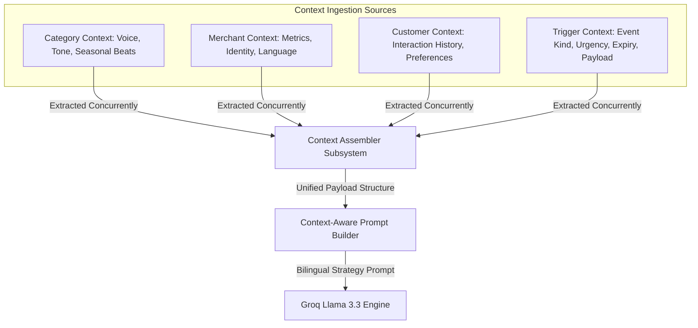
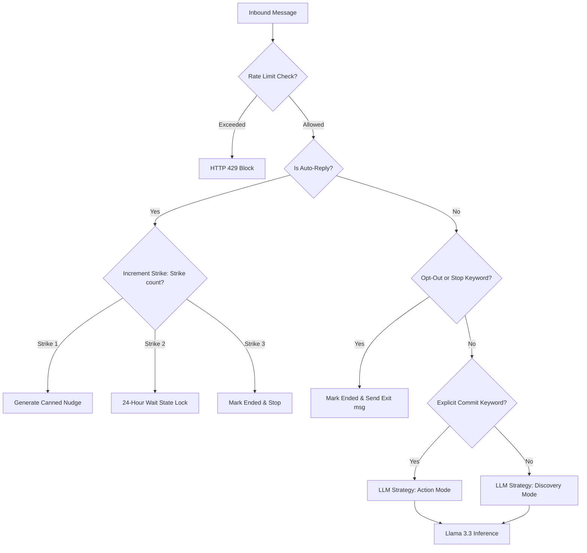
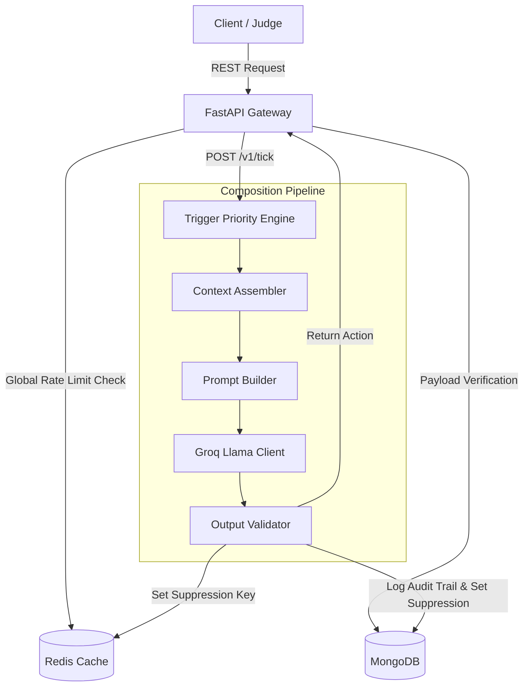
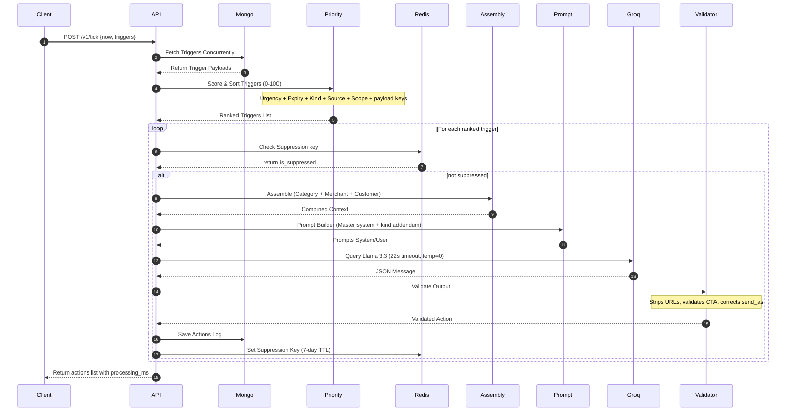
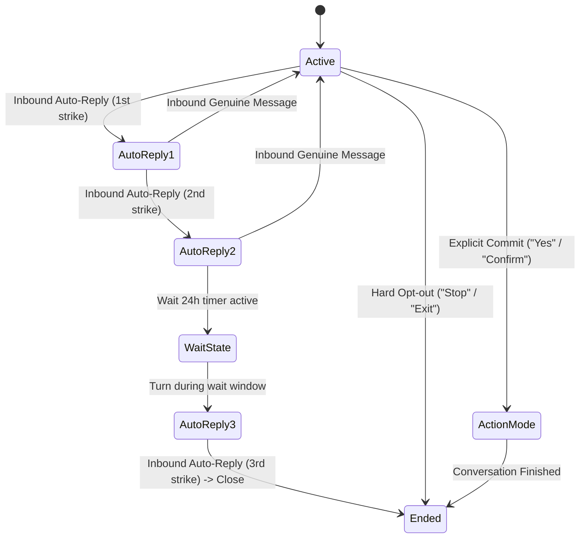

# 🌌 NEXORA: AI Merchant Engagement Engine

[](https://python.org)
[](https://fastapi.tiangolo.com)
[](https://groq.com)
[](https://redis.io)
[](https://mongodb.com)
[](https://docker.com)
[](https://pytest.org)
[](https://opensource.org/licenses/MIT)

NEXORA is a production-grade AI decision and engagement platform that transforms dynamic business context into intelligent, personalized customer interactions. Leveraging structured datasets, trigger-priority orchestration, context-aware prompt engineering, multi-turn conversational intelligence, and enterprise-grade validation, it autonomously generates explainable WhatsApp engagements through a resilient, scalable architecture.

Team: NEXORA Engine · Stack: FastAPI · MongoDB · Redis · Groq (Llama 3.3) · Next.js

> Built on a fully data-driven architecture with intelligent trigger orchestration, explainable AI decisions, resilient conversation state management, and enterprise-grade validation.


## 📌 Table of Contents

1.  [🌟 What is NEXORA?](#-what-is-nexora)
2.  [🧠 How NEXORA Thinks](#-how-nexora-thinks)
3.  [🏗️ System Architecture](#%EF%B8%8F-system-architecture)
4.  [⚙️ Technology Stack](#%EF%B8%8F-technology-stack)
5.  [✨ Feature Highlights](#-feature-highlights)
6.  [🚀 Quick Start (Docker)](#-quick-start-docker)
7.  [💻 Local Setup (No Docker)](#-local-setup-no-docker)
8.  [📡 API Reference Summary](#-api-reference-summary)
9.  [❌ Error Ingestion & Codes](#-error-ingestion--codes)
10. [📊 Trigger Priority Ranking](#-trigger-priority-ranking)
11. [🔔 Supported Trigger Kinds](#-supported-trigger-kinds)
12. [🔧 Configuration Environment](#-configuration-environment)
13. [🧪 Testing Framework](#-testing-framework)
14. [📁 Project Structure](#-project-structure)
15. [⚖️ Judge Evaluation Workflow](#%EF%B8%8F-judge-evaluation-workflow)
16. [📄 License](#-license)


## 🌟 What is NEXORA?

NEXORA is a production-grade merchant engagement assistant engineered for magicpin’s AI Challenge. The core service acts as an autonomous cognitive gateway, converting background data events (triggers) into highly personalized, contextual WhatsApp outreach.

Unlike basic templated bots, NEXORA enforces a strict **4-context resolution** (Category, Merchant, Customer, Trigger) to anchor all LLM generation. Every number, percentage, date, and name must exist in the context payloads; hallucinations are strictly blocked by the validation pipeline.

By combining low-latency inference on Groq's Llama 3.3 with local cache controls via Redis and persistent audit logging in MongoDB, NEXORA satisfies the challenge's strict 30-second response budget while guaranteeing production safety, conversation state tracking, and rate limiting.

### 4-Context Assembler Architecture



### 🎭 Category Verticals & Voice Registers

NEXORA adapts its conversational register dynamically to match the expected tone of different local business categories:

*   **Dentists (`dentists`):** Uses a *clinical peer* voice. Tone is professional and clinical. It references patient segments, clinical studies, and page numbers, strictly avoiding marketing buzzwords like "discount" or "cheap offer."
*   **Salons & Spas (`salons`):** Employs a *warm and practical* tone. It emphasizes relaxation, personal care windows, prep durations, and reservation slot convenience.
*   **Gyms & Fitness (`gyms`):** Communicates as a *motivational coach*. Emphasizes habit consistency, metric goals, active participation, and slot availability.
*   **Restaurants & Dining (`restaurants`):** Uses an *operator-to-operator* register. Discusses delivery margins, covers-per-hour, seasonal spikes, kitchen prep constraints, and match-day forecasts.
*   **Pharmacies (`pharmacies`):** Adopts a *trustworthy and precise* tone. Focuses on refill schedules, senior discount programs, batch verification, and molecule safety alerts.


## 🧠 How NEXORA Thinks

NEXORA follows a systematic workflow to evaluate opportunities and compose messages:

1.  **Ingestion:** Real-time system states (contexts) are pushed via an idempotent HTTP API. Stale version numbers are rejected immediately.
2.  **Prioritization:** Active trigger signals are prioritized and sorted using a deterministic, multi-dimensional formula (calculating urgency, expiry, business kind, and context richness).
3.  **Assembly:** Category voice parameters, merchant metrics, customer history, and trigger payloads are merged into a single multi-dimensional context.
4.  **Composition:** The prompt builder dispatches the assembled context to the LLM (temperature $T=0$, running on Groq Llama 3.3). If Groq experiences an outage, it automatically fails over to a secondary Llama 3.1 model.
5.  **Verification:** The validation engine analyzes the generated message. It strips dangerous URLs, checks for required psychological compulsion levers, corrects mismatching sender scopes, and blocks repetitions.
6.  **Outreach:** Compliant actions are returned to the client and logged to MongoDB. Suppression keys are set in Redis to prevent outreach fatigue.

### 🧭 Inbound Reply Evaluation Pipeline

When an inbound reply turn is received via `POST /v1/reply`, NEXORA executes a pipeline to determine the appropriate response:

*   **Rate Limit Check:** Evaluates both IP limits and conversation turn limits in Redis to prevent loops.
*   **Active Thread Check:** Confirms if the conversation has already been marked as ended in Redis.
*   **Auto-Reply Detection:** Uses pattern matching to identify automatic business canned messages. If detected, it increments a strike counter in Redis and triggers wait or end states.
*   **Opt-Out Router:** Scans the text for hard-stop keywords. If matched, it sets the conversation status to ended and generates a polite exit message.
*   **Commit Router:** Scans for affirmative signals. If matched, it transitions the LLM prompt to Action Mode.
*   **Language Check:** Analyzes characters and Hinglish code-mix markers to adjust translation directives.
*   **LLM Compilation:** Submits the compiled turn history and category constraints to the LLM.

### Inbound Reply Classifier & Intent Flow




## 🏗️ System Architecture

### Core Components Flow



### Request Lifecycle (`POST /v1/tick`)



### Conversation Reply State Machine




## ⚙️ Technology Stack

*   **Runtime Framework:** FastAPI (Python 3.13)
*   **Database (Durable Store):** MongoDB 7 (Persistent context payloads, action logs, audit trails)
*   **Cache (In-memory Cache):** Redis 7 (Version checking, sliding-window rate limiters, suppression keys)
*   **Inference Gateway:** Groq API client
*   **Primary LLM Model:** Llama-3.3-70b-versatile (deterministic execution, $T=0$)
*   **Fallback LLM Model:** Llama-3.1-8b-instant (automatic failover)
*   **UI Dashboard:** Next.js (App Router, Tailwind v4, TypeScript)
*   **Deployment:** Docker, Docker Compose


## ✨ Feature Highlights

*   **🔒 Strict URL Stripping:** Strips any inbound or outbound URLs to comply with Meta's messaging policies, avoiding API penalties.
*   **⚡ Idempotence & Version Checking:** Context updates enforce strict monotonically increasing versions. Out-of-order or duplicate updates are rejected.
*   **🛡️ Resilient Health Checks:** The `/v1/healthz` endpoint handles database exceptions gracefully, reporting `degraded` connectivity status rather than returning a 500 server error.
*   **🗣️ Bilingual Hindi-English (Hinglish):** Seamless code-mixing for merchants with `"hi"` language preferences, mirroring local Indian commerce styles naturally.
*   **🤖 Automated Responder Mitigation:** Implements a three-strike rule to prevent infinite loops when interacting with automated business reply systems.
*   **🔬 Diagnostic Decision Auditor:** Includes `/v1/action/{id}/explain` to expose exactly why actions were taken, which category beats matched, and what compulsion levers were used.


## 🚀 Quick Start (Docker)

To run the complete stack (FastAPI Backend, Next.js Frontend, MongoDB, Redis):

1.  **Clone and Configure:**
    ```bash
    git clone https://github.com/UjjwalSaini07/Nexora-Studio
    ```
    ```bash
    cd Nexora-Studio
    cp .env.example .env
    ```
    Set your **Groq API Key** in `.env`:
    ```env
    GROQ_API_KEY=gsk_your_groq_api_key_here
    ```
    Project settings are centralized in config.py & .env and the service modules. If you need the exact deployment values, service wiring, or notification settings & the keys for your environment, contact the author through the [Author & System Architect](#%E2%80%8D-author--lead-architect) section at the end of this README.

2.  **Launch Stack:**
    ```bash
    docker compose up --build -d
    ```

3.  **Verify Health:**
    ```bash
    curl http://localhost:8080/v1/healthz
    ```

4.  **Explore Operations Dashboard:**
    Open `http://localhost:3000` to inspect live operations, conversation threads, and context versions.


## 💻 Local Setup (No Docker)

### Backend
```bash
cd backend
cp .env.example .env
# Edit backend/.env and configure 
```

```bash
python -m venv venv
```
```bash
source venv/bin/activate  # Windows: venv\Scripts\activate
```
```bash
pip install -r requirements.txt
```
```bash
# Pre-seed the MongoDB database with expanded mock dataset
python3 ../dataset/generate_dataset.py --seed-dir ../dataset --out ../expanded
```
```bash
# Start the development server
uvicorn main:app --host 0.0.0.0 --port 8080 --reload
```

### Frontend Dashboard
```bash
cd frontend
cp .env.example .env.local
# Set NEXT_PUBLIC_BOT_URL=http://localhost:8080 in env.local
npm install
npm run dev
```


## 📡 API Reference Summary

| HTTP Verb | Path | Request Body | Success Code | Purpose |
| :--- | :--- | :--- | :---: | :--- |
| **`GET`** | `/v1/healthz` | *None* | `200` | Liveness check (DB connectivity & uptime). |
| **`GET`** | `/v1/metadata` | *None* | `200` | Team metadata and challenge approach. |
| **`POST`** | `/v1/context` | `ContextBody` JSON | `200` | Ingest new context versions. |
| **`POST`** | `/v1/tick` | `TickBody` JSON | `200` | Evaluate triggers and return actions. |
| **`POST`** | `/v1/reply` | `ReplyBody` JSON | `200` | Process conversational reply turns. |
| **`POST`** | `/v1/teardown` | *None* | `200` | Wipe all tables (called between test windows). |
| **`POST`** | `/v1/demo/reset`| *None* | `200` | Clear suppression, wait states, and conversations. |
| **`GET`** | `/v1/action/{id}/explain`| *None* | `200` | Audit decision path for a conversation. |

### 🔍 Explaining AI Decisions (`/v1/action/{conversation_id}/explain`)

NEXORA exposes its full cognitive routing trace through the explain endpoint. This returns diagnostic details about why a specific trigger was prioritized and what factors were extracted during generation:

```json
{
  "conversation_id": "conv_m_001_trg_001",
  "trigger_id": "trg_001",
  "why_selected": "Trigger 'trg_001' of kind 'research_digest' with urgency 3 was selected and assigned a priority score of 75 (ranked #1).",
  "priority_breakdown": {
    "score": 75,
    "rank": 1,
    "reason": "score=75: [urgency=3/5 -> 15pts] + [expires_in=24.5h -> 20pts] + [kind=research_digest -> 8pts] + [source=external -> 10pts] + [scope=merchant -> 7pts] + [payload_keys=2 -> 4pts]"
  },
  "merchant_signals_used": ["low_ctr"],
  "category_signals_used": ["Nov-Feb exam-stress bruxism spike"],
  "customer_signals_used": [],
  "compulsion_levers_used": ["specificity", "effort_externalization"],
  "confidence_score": 0.92,
  "suppression_status": {
    "is_suppressed": false,
    "suppression_key": "sup_research_m_001"
  },
  "wait_state_status": {
    "is_waiting": false,
    "wait_until": null
  },
  "rationale": "Anchored on recent clinical digest item. Proposing patient campaign workflow utilizing commitment lever."
}
```


## ❌ Error Ingestion & Codes

The API wraps validation and runtime errors in a standard error schema:

```json
{
  "success": false,
  "accepted": false,
  "reason": "error_reason_slug",
  "error": {
    "code": "ERROR_CODE_SLUG",
    "message": "Detailed error description."
  }
}
```

Standard Codes:
*   `INVALID_JSON` (400): Malformed JSON syntax in request body.
*   `BAD_REQUEST` (400): Invalid scope provided in context push.
*   `TRIGGER_NOT_FOUND` (404): Specified trigger ID does not exist.
*   `MERCHANT_NOT_FOUND` (404): Specified merchant ID does not exist.
*   `CUSTOMER_NOT_FOUND` (404): Specified customer ID does not exist.
*   `PAYLOAD_TOO_LARGE` (413): Request body exceeds `2MB` cap.
*   `VALIDATION_ERROR` (422): Request parameters failed validation checks.
*   `RATE_LIMIT_EXCEEDED` (429): Global or endpoint rate limits exceeded.
*   `INTERNAL_ERROR` (500): Unexpected exception in backend code.


## 📊 Trigger Priority Ranking

Triggers processed during `/v1/tick` are ranked using a deterministic 0-100 score:

$$\text{Priority Score} = S_{\text{urgency}} + S_{\text{expiry}} + S_{\text{kind}} + S_{\text{source}} + S_{\text{scope}} + S_{\text{payload}}$$

1.  **Urgency (Max 25):** Clamped urgency score ($1 \text{ to } 5$) $\times 5$.
2.  **Expiry Proximity (Max 25):** Expiry window proximity scoring. $\le 24$ hours left = $25\text{pts}$. $\ge 168$ hours left = $0\text{pts}$. No expiry = $12\text{pts}$.
3.  **Kind Weight (Max 20):** Business kind weight assigned to the trigger kind.
4.  **Source Weight (Max 10):** `external` = $10\text{pts}$, `internal` = $6\text{pts}$.
5.  **Scope Weight (Max 10):** `customer` (direct revenue) = $10\text{pts}$, `merchant` = $7\text{pts}$.
6.  **Payload Richness (Max 10):** Number of payload dictionary keys $\times 2$ (capped at 10).

*Ties are broken lexicographically by trigger ID.*


## 🔔 Supported Trigger Kinds

NEXORA supports 27 trigger configurations:

*   **Critical Events (20pts):** `supply_alert`, `regulation_change`.
*   **High Commercial Value (18pts):** `appointment_tomorrow`, `recall_due`, `chronic_refill_due`.
*   **Retention Nudges (16pts):** `renewal_due`.
*   **Performance Signals (14-15pts):** `perf_spike`, `perf_dip`, `seasonal_perf_dip`, `competitor_opened`.
*   **Warmup Tests & Loops (10-13pts):** `customer_lapsed_hard`, `ipl_match_today`, `winback_eligible`, `bridal_followup`, `wedding_package_followup`, `festival_upcoming`, `trial_followup`, `customer_lapsed_soft`, `category_seasonal`.
*   **Relationship Celebrations (5-9pts):** `milestone_reached`, `review_theme_emerged`, `gbp_unverified`, `cde_opportunity`, `research_digest`, `active_planning_intent`, `dormant_with_nexora`, `curious_ask_due`.


## 🔧 Configuration Environment

*   `GROQ_API_KEY` (Required): API key for Llama model calls.
*   `LLM_MODEL` (Default: `llama-3.3-70b-versatile`): Core composition model.
*   `LLM_FALLBACK_MODEL` (Default: `llama-3.1-8b-instant`): Failover composition model.
*   `LLM_TIMEOUT_SECONDS` (Default: `22`): Threshold before attempting failover.
*   `MONGO_URI` (Default: `mongodb://localhost:27017`): MongoDB connection string.
*   `REDIS_URL` (Default: `redis://localhost:6379`): Redis connection string.
*   `RATE_LIMIT_PER_MINUTE` (Default: `1200`): Global request rate limit per minute.
*   `DEMO_MODE` (Default: `true`): Bypasses suppression logic for demonstration purposes.
*   `ENABLE_AUTH` (Default: `false`): Enables token authentication.
*   `API_AUTH_TOKEN` (Default: *None*): Authorization Bearer token.


## 🧪 Testing Framework

NEXORA includes an extensive test suite with **101 tests (100% passing)**:

```bash
cd backend
pytest tests/ -v
```

### Target Test Scopes
*   **Unit Tests:** Prompt formatting, lever matching, language switching, output validation.
*   **Integration Tests:** Core API flows, versioning controls, wait-state timers, rate limit blocks.
*   **Warmup Tests:** Warmup simulation matching Phase 1 of the testing brief (verifies that 255 base contexts load successfully).
*   **Validation Tests:** Simulates all 30 canonical test cases against the live API, validating output schemas and formatting.


## 📁 Project Structure

```
Nexora-Studio/
├── backend/                  # FastAPI Application Code
│   ├── main.py               # Lifespan coordination, middleware initialization, exception handlers
│   ├── bot.py                # Thin entrypoint alias for uvicorn launcher
│   ├── config.py             # Environment configurations
│   ├── middleware.py         # Global rate limiter, payload size verifier, logging middleware
│   ├── models/               # Pydantic schemas (requests, responses, contexts)
│   ├── storage/              # Database adapter singletons (Redis, MongoDB)
│   ├── composer/             # Message composition pipeline modules
│   ├── reply/                # Multi-turn conversational handler modules
│   ├── routers/              # API controller route endpoints
│   ├── dataset/              # Mock dataset loaders and seeding tools
│   ├── tests/                # 101 automated test cases
│   └── Dockerfile            # Container configuration (runs as non-root user)
├── frontend/                 # Next.js UI operations dashboard
├── dataset/                  # Challenge base JSON seeds
├── expanded/                 # Seeding dataset generated at build
├── documents/                # Challenge documentation files
├── docker-compose.yml        # Orchestration file
├── judge_simulator.py        # Local testing grading simulator
└── generate_submission.py    # Submits 30 canonical tests to API -> submission.jsonl
```


## ⚖️ Judge Evaluation Workflow

To verify NEXORA against the Magicpin AI Challenge grading harness:

1.  **Launch Stack:**
    ```bash
    docker compose up --build
    ```
2.  **Verify Health & Load Status:**
    ```bash
    curl http://localhost:8080/v1/healthz
    # Ensure all contexts are preloaded (category: 5, merchant: 50, customer: 200, trigger: 100)
    ```
3.  **Run Grading Simulator:**
    ```bash
    python3 judge_simulator.py --bot-url http://localhost:8080 --groq-api-key $GROQ_API_KEY
    ```
4.  **Inspect Score Diagnostic Log:**
    EXamine the generated audit logs on the dashboard (`http://localhost:3000/scores`) to verify URL compliance, compulsion checks, and response latency.


## 📤 Generating Submission File

The `generate_submission.py` script produces the official `submission.jsonl` file required by the magicpin AI Challenge. It drives the live running bot through its HTTP API (`/v1/context` and `/v1/tick`) using the 30 canonical test cases, validating response formatting and schemas dynamically. This ensures that the generated submission file matches exactly what the live bot would output during evaluation.

### Windows (PowerShell) Run Instructions

To generate the submission file from the `backend/` directory:

1.  **Launch the Backend Server:** Start your FastAPI backend in a PowerShell window:
    ```powershell
    uvicorn main:app --host 0.0.0.0 --port 8080
    ```

2.  **Run the Generator Script:** Open a second PowerShell window, change directory to `backend/`, configure the `BOT_URL` environment variable, and execute the generator:
    ```powershell
    cd backend
    $env:BOT_URL="http://localhost:8080"
    ```
    ```bash
    python ../generate_submission.py --expanded-dir ../expanded --out ../submission.jsonl
    ```

*If using standard Windows Command Prompt (CMD), run:*
```cmd
cd backend
set BOT_URL=http://localhost:8080
python ..\generate_submission.py --expanded-dir ..\expanded --out ..\submission.jsonl
```

### Expected Output

Upon successful execution, the script will output log traces indicating contexts are loaded and tick events are evaluated:

```
Loaded 30 canonical test pairs.
Verifying connection to http://localhost:8080/v1/healthz ... Connected!
[1/30] Processing trigger: trg_001_recall_due for merchant: m_001_drmeera_dentist_delhi
Pushed category, merchant, customer, and trigger contexts.
Executing tick event...
Generated action successfully (CTA: multi_choice_slot)
...
[30/30] Processing trigger: trg_030_curious_ask_due for merchant: m_010_nupurdental_dentist_delhi
Generated action successfully (CTA: binary_yes_no)

Successfully completed all 30 test pairs.
Submission file saved at: F:\_Code\Nexora-Studio\submission.jsonl
```

## 📸 Screenshots

<table>
  <tr>
    <td align="center">
      
      <br/>
      <b>Overview Tab 1</b>
    </td>
    <td align="center">
      
      <br/>
      <b>Overview Tab 2</b>
    </td>
  </tr>
</table>
<table>
  <tr>
    <td align="center">
      
      <br/>
      <b>Overview Tab 3</b>
    </td>
    <td align="center">
      
      <br/>
      <b>Overview Tab 4</b>
    </td>
  </tr>
</table>

<table>
  <tr>
    <td align="center">
      
      <br/>
      <b>Overview Tab 5</b>
    </td>
    <td align="center">
      
      <br/>
      <b>Conversation Tab 1</b>
    </td>
  </tr>
</table>

<table>
  <tr>
    <td align="center">
      
      <br/>
      <b>Conversation Tab 2</b>
    </td>
    <td align="center">
      
      <br/>
      <b>Conversation Tab 3</b>
    </td>
  </tr>
</table>

<table>
  <tr>
    <td align="center">
      
      <br/>
      <b>Contexts Tab 1</b>
    </td>
    <td align="center">
      
      <br/>
      <b>Contexts Tab 2</b>
    </td>
  </tr>
</table>

<table>
  <tr>
    <td align="center">
      
      <br/>
      <b>Contexts Tab 3</b>
    </td>
    <td align="center">
      
      <br/>
      <b>Contexts Tab 4</b>
    </td>
  </tr>
</table>


<table>
  <tr>
    <td align="center">
      
      <br/>
      <b>Simulator Tab 1</b>
    </td>
    <td align="center">
      
      <br/>
      <b>Simulator Tab 2</b>
    </td>
  </tr>
</table>

<table>
  <tr>
    <td align="center">
      
      <br/>
      <b>Simulator Tab 3</b>
    </td>
    <td align="center">
      
      <br/>
      <b>Scores Tab 1</b>
    </td>
  </tr>
</table>

<table>
  <tr>
    <td align="center">
      
      <br/>
      <b>Scores Tab 2</b>
    </td>
    <td align="center">
      
      <br/>
      <b>Scores Tab 3</b>
    </td>
  </tr>
</table>

<table>
  <tr>
    <td align="center">
      
      <br/>
      <b>Architecture Tab 1</b>
    </td>
    <td align="center">
      
      <br/>
      <b>Architecture Tab 2</b>
    </td>
  </tr>
</table>

## 📄 License

This project is licensed under the MIT License. See [LICENSE](/LICENSE) for more details.


## 👨‍💻 Author & Lead Architect

**Ujjwal Saini**
Founder, Lead Engineer & System Architect

Passionate Full-Stack Engineer specializing in AI-powered systems, computer vision, real-time analytics, and scalable platform architecture. Focused on building production-grade solutions that transform raw operational data into actionable business intelligence. Hey, I'm Ujjwal — a creative full-stack developer with a deep love for design, motion, and digital storytelling. I bring bold ideas to life through stunning interfaces and seamless user experiences, always chasing clarity in every interaction.

My stack is MERN-focused, but my mindset is product-first. I thrive in fast-paced environments where innovation and precision matter, constantly pushing for smarter, cleaner, and faster solutions.

*   **Portfolio:** [ujjwalsaini.vercel.app](https://ujjwalsaini.vercel.app)
*   **GitHub:** [@UjjwalSaini07](https://github.com/UjjwalSaini07)
*   **LinkedIn:** [@ujjwalsaini07](https://linkedin.com/in/ujjwalsaini07)
*   **Twitter/X:** [@UjjwalSx007](https://x.com/UjjwalSx007)
*   **Email:** [ujjwalsaini0007+nexora@gmail.com](mailto:ujjwalsaini0007+nexora@gmail.com)
