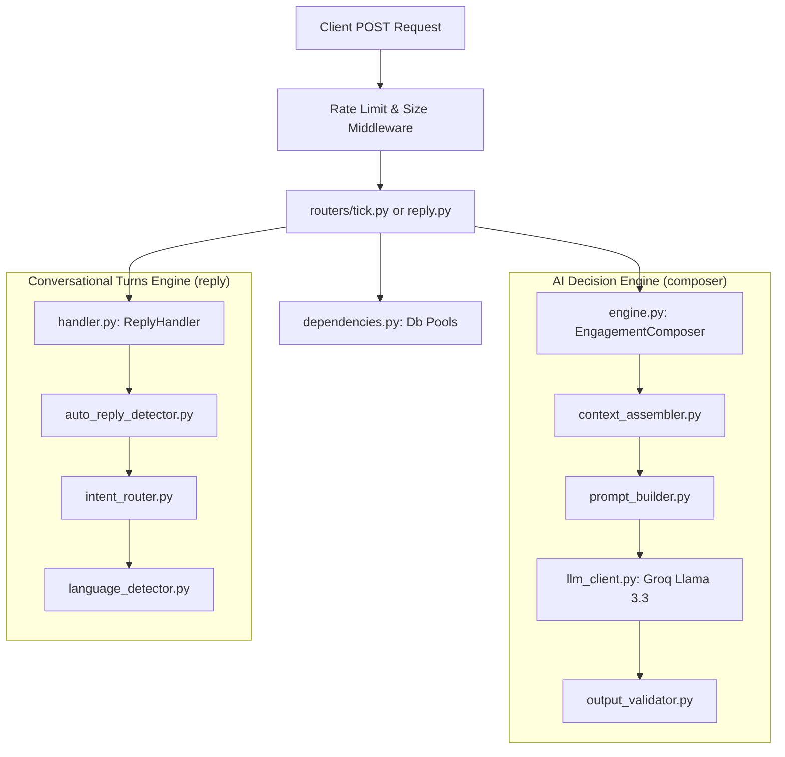
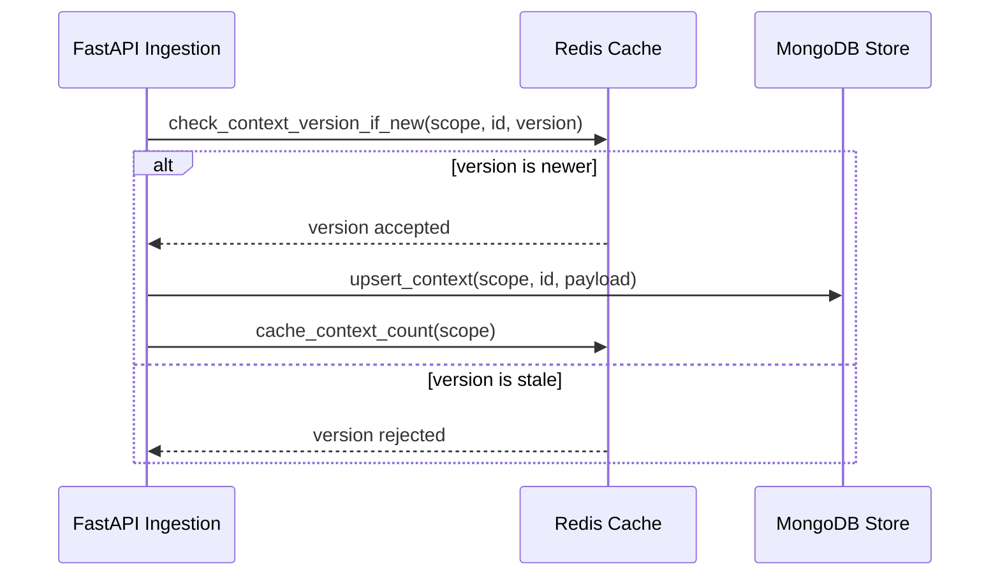

# 🌌 NEXORA: FastAPI Backend Engine

FastAPI application implementing the full magicpin AI Challenge HTTP contract. This backend orchestrates context ingestion, trigger priority evaluation, deterministic LLM prompt compilation, and conversational state transitions.

See the [repo-level README](../README.md) for full system architecture, docker orchestration, and requirements checklists.

## 🧱 Backend Architecture Pipeline

The diagram below details the operational pipelines inside the FastAPI backend, showing how middleware, routers, datastores, and the composer/reply pipelines interact:



## 🚀 Setup & Execution

### 1. Configure the Environment
Refer to the [.env.example](file:///f:/_Code/Nexora-Studio/backend/.env.example) file for all configurations. Create a `.env` file in the `backend/` directory containing the following keys:
```env
GROQ_API_KEY=gsk_your_groq_api_key_here
GROQ_BASE_URL=https://api.groq.com/openai/v1
LLM_MODEL=llama-3.3-70b-versatile
LLM_FALLBACK_MODEL=llama-3.1-8b-instant
LLM_MAX_TOKENS=600
LLM_TEMPERATURE=0
LLM_TIMEOUT_SECONDS=22

MONGO_URI=mongodb://localhost:27017
MONGO_DB=nexora_bot
REDIS_URL=redis://localhost:6379

TEAM_NAME=Your Team Name
TEAM_MEMBERS=Ujjwal Saini
CONTACT_EMAIL=ujjwalsaini0007@gmail.com
BOT_VERSION=1.0.0
SUBMITTED_AT=2026-06-25T08:00:00Z

TICK_MAX_ACTIONS=20
CONTEXT_PAYLOAD_SIZE_CAP_KB=500
REPLY_TIMEOUT_SECONDS=28
TICK_TIMEOUT_SECONDS=25

ENABLE_AUTH=
API_AUTH_TOKEN=

RATE_LIMIT_PER_MINUTE=1200

CORS_ALLOW_ORIGINS=*

LOG_LEVEL=INFO
ENVIRONMENT=development

EXPANDED_DATASET_DIR=
DEMO_MODE=
```

### 2. Local Virtual Environment Setup
Verify you have MongoDB and Redis running locally before starting the server.

*   **Linux / macOS:**
    ```bash
    python3 -m venv venv
    source venv/bin/activate
    pip install -r requirements.txt
    python3 ../dataset/generate_dataset.py --seed-dir ../dataset --out ../expanded
    uvicorn main:app --host 0.0.0.0 --port 8080 --reload
    ```

*   **Windows (PowerShell):**
    ```powershell
    python -m venv venv
    .\venv\Scripts\Activate.ps1
    pip install -r requirements.txt
    python ..\dataset\generate_dataset.py --seed-dir ..\dataset --out ..\expanded
    uvicorn main:app --host 0.0.0.0 --port 8080 --reload
    ```

## 🧪 Running Automated Tests
NEXORA compiles a comprehensive test suite (101 tests, 100% passing) that runs fully isolated without needing real database connections:

```bash
pip install -r requirements.txt   # installs pytest, fakeredis, mongomock-motor
pytest tests/ -v
```

*   **In-Memory Mocking:** Redis connections are automatically replaced by `fakeredis`, MongoDB uses `mongomock-motor`, and LLM API calls are patched at the `LLMClient.complete` boundary.

## 💾 Datastore Sync Sequence



## 📁 Module Directory Mapping

| Module | Responsibility |
| :--- | :--- |
| **`main.py`** | Application assembly, lifespan hooks (warmups, DB index creation), custom exception handlers, and middlewares. |
| **`bot.py`** | One-line alias importing and exposing `main.app`, so `uvicorn bot:app` runs per the testing brief's specification. |
| **`config.py`** | Centralizes configuration constants (e.g. rate limits, tokens, model fallbacks) loaded from `.env`. |
| **`dependencies.py`** | FastAPI injection dependency providers for Redis/Mongo singletons and bearer authentication filters. |
| **`middleware.py`** | RateLimitingMiddleware (IP client level), RequestLoggingMiddleware, and PayloadSizeMiddleware. |
| **`logging_config.py`** | Structured JSON logs in production; colored, readable logs for local developer sessions. |
| **`models/`** | Contains Pydantic data schemas: `context.py` (category/merchant/customer/trigger definitions), `requests.py` (API body shapes), and `conversation.py` (turn arrays). |
| **`storage/`** | Implements storage adapters: `redis_store.py` (locks, suppression, versions) and `mongo_store.py` (collection logs). |
| **`composer/`** | Orchestrates AI operations: `context_assembler.py` (context gathering), `prompt_builder.py` (prompt structures), `llm_client.py` (Groq API connections), `output_validator.py` (JSON validations), and `engine.py` (composer entrypoint). |
| **`reply/`** | Manages conversation logic: `auto_reply_detector.py` (strike logic), `intent_router.py` (stops/commits), `language_detector.py` (Hinglish switches), and `handler.py` (state machine router). |
| **`routers/`** | Contains API endpoints: health, metadata, context, tick, reply, dashboard, explain, and teardown. |
| **`dataset/`** | Implements the preloader and database pre-population sequences. |
| **`dev_tools/`** | Development sandbox tools (mock server adapters, local simulation test runners). |

## 🧬 Context Resiliency Design

The seed datasets for the magicpin challenge are highly heterogeneous:
*   `subscription` features vary based on plan statuses (gold vs silver).
*   `customer_aggregate` has varying properties across category verticals.
*   Merchants carries dynamic key/value properties (such as review topics and local stats).

To prevent validation failures (`HTTP 422 Unprocessable Entity`) when processing valid dataset pushes, Pydantic schemas under `models/context.py` are configured with `extra="allow"` and utilize optional field bindings. This trades strict schema checks for operational resilience, ensuring that unexpected dataset features do not crash the ingestion cycle.
