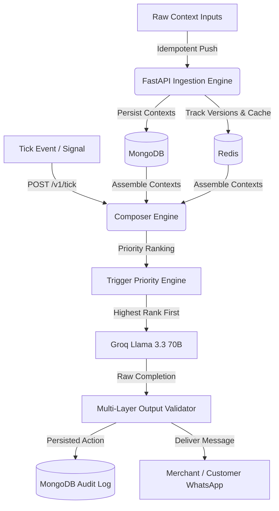

# 🌌 NEXORA: System Overview

Welcome to the official documentation for **NEXORA**, a production-grade merchant engagement engine designed for the **magicpin AI Challenge**. 

NEXORA acts as a hyper-personalized, context-aware bridge between real-time business signals (triggers) and conversational channels (primarily WhatsApp Business). By combining a high-performance FastAPI backend with MongoDB, Redis, and low-latency LLM inference via Groq, NEXORA enables merchants to automatically run highly targeted campaigns, follow ups, and compliance processes.

## 📖 The Problem Statement

In local commerce ecosystems, merchants (restaurants, salons, doctors, gyms, pharmacies) are constantly overwhelmed by operational tasks. While they have access to rich datasets—seasonal patterns, local competitor openings, customer aggregates, regulatory alerts, and performance metrics—they lack the bandwidth to translate these signals into meaningful consumer actions.

Existing automation engines fail because they are:
1. **Generic:** Sending identical template spam that customers mute immediately.
2. **Context-Deaf:** Recommending a discount to a luxury salon, or alarming a gym owner about a seasonal summer lull that is completely normal.
3. **Conversational Dead-ends:** Broadcast systems that cannot handle follow-ups, hostile opt-outs, or bilingual queries.

## ⚡ The NEXORA Solution

NEXORA addresses these challenges by transforming raw, multi-dimensional database events into hyper-personalized, multi-turn conversational workflows. 

### Core Value Propositions

*   **🔒 Strict Context Anchoring (No Hallucinations):** Every generated message is strictly grounded in the category, merchant, customer, and trigger contexts. All numeric claims (e.g., specific CTR metrics, patient counts, renewal amounts) are verified against the database.
*   **🎯 Deterministic Execution:** Running LLMs at $T = 0$ guarantees that identical database states yield identical outreach messaging, preventing production surprises.
*   **🏎️ Low-Latency High-Throughput Pipelines:** Real-time generation runs on Groq-hosted Llama-3.3-70b-versatile, keeping the entire composition and validation cycle well under the challenge's 30-second budget.
*   **🔄 Complete Multi-turn State Tracking:** Handles WhatsApp-specific conversational nuances, including auto-replies, explicit opt-out/stops, intent transition markers (curious -> committed -> execution), and mid-conversation bilingual (Hindi/English) code-switching.

## 🧩 The 4-Context Composition Model

Every cognitive decision in NEXORA is synthesized by merging four distinct context perspectives:

*   **Category Context (`category`):** Defines the industry vertical rules (dentists, salons, gyms, etc.). It specifies the voice/tone register, prohibited terminology (taboos), seasonal trend baselines, and active campaigns.
*   **Merchant Context (`merchant`):** Stores the profile of the business (name, locations, language preferences) and detailed operational metrics (weekly views, calls, click-through rates, and peer averages).
*   **Customer Context (`customer`):** Captures individual consumer relationships (visit logs, specific services consumed, booking habits, and age groups).
*   **Trigger Context (`trigger`):** The activation event detailing the type of alert (e.g., regulatory changes, appointment reminders, competitor openings, lapsed visit windows), urgency scale (1-5), and expiration deadlines.

## 🧠 Engagement & Compulsion Levers

NEXORA embeds psychological engagement hooks inside messages to drive response rates, checking for compliance before dispatch:

*   **Specificity & Verifiability:** Anchoring on precise metrics (e.g., "views up 28%", "competition is 1.3km away") instead of vague statements.
*   **Effort Externalization:** Decreasing friction by offering to handle the work (e.g., "Want me to draft the post for you?", "Reply 1 to book").
*   **Loss Aversion:** Highlighting time-bound constraints (e.g., "regulation effective on 15th", "supply runs out in 24 hours").
*   **Curiosity & Anticipation:** Pique interest regarding competition or milestones (e.g., "Want to see how Mylari compares?").
*   **Social Proof:** Highlighting peer median scores or customer benchmarks (e.g., "your CTR is 0.05 vs peer average of 0.04").
*   **Single Binary Commitment:** Framing decisions as easy YES/NO choices to minimize drop-off.

## 🧱 Core Concepts

The NEXORA architecture revolves around six primary concepts:

| Concept | Purpose | Description |
| :--- | :--- | :--- |
| **Context** | Input Ingestion | Structured documents representing the state of the world across four scopes: `category`, `merchant`, `customer`, and `trigger`. |
| **Trigger** | Activation Signal | An event representing a business opportunity or action item (e.g., `recall_due`, `perf_dip`, `regulation_change`). |
| **Action** | Engagement Output | A finalized message compiled by NEXORA, validated for compliance, and ready to be delivered. |
| **Suppression** | Fatigue Prevention | A Redis-backed dedup mechanism preventing duplicate outreach within a 7-day window. |
| **Wait State** | Conversation Control | A Redis-backed temporal lock that pauses outreach if the user has requested a delay or if an auto-reply loop is detected. |
| **Priority Score** | Deterministic Ranking | A 0-100 metric calculating which trigger deserves execution first during a tick evaluation. |

## 🛡️ Key System Capabilities

*   **Idempotency & Version Control:** Rejects stale context updates automatically based on a monotonically increasing version index.
*   **Bilingual Code-Switching:** Seamlessly switches between clean English and Hindi-English code-mix (Hinglish) based on merchant configuration.
*   **Auto-Reply Mitigation:** Implements a three-strike rule to prevent infinite loops when interacting with automated business responders.
*   **Graceful Degradation:** A robust health framework ensuring that database outages degrade the system status (`healthz` -> `degraded`) rather than causing a total application crash.

## 🚫 Out of Scope (Non-Goals)

To ensure high-performance and strict focus, NEXORA does **not**:
*   *Manage SMS/WhatsApp carrier connections directly.* It acts as a cognitive routing layer, exposing HTTP payloads for external delivery gateways.
*   *Support arbitrary prompt injection.* The validation pipeline immediately flags and strips off-topic messages or malicious inputs.

👉 **Next Steps:** Proceed to the [System Architecture](/docs/02-architecture.md) documentation to learn how these concepts are implemented.
