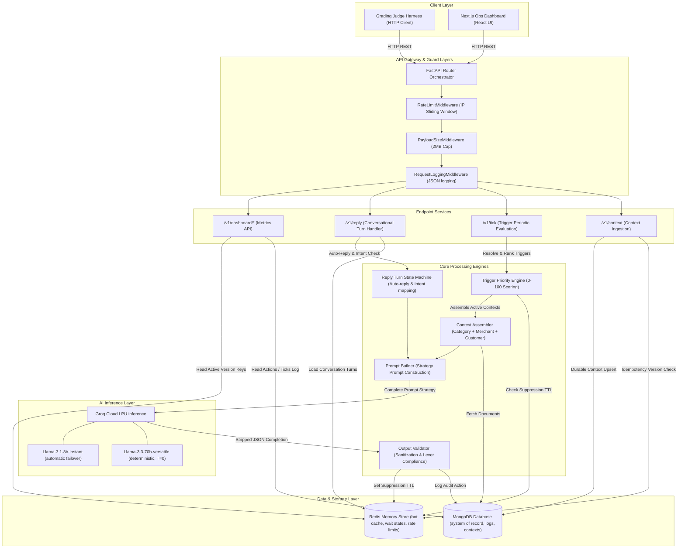
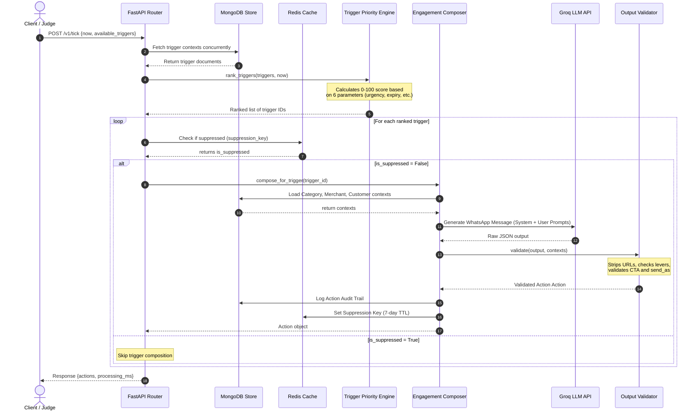
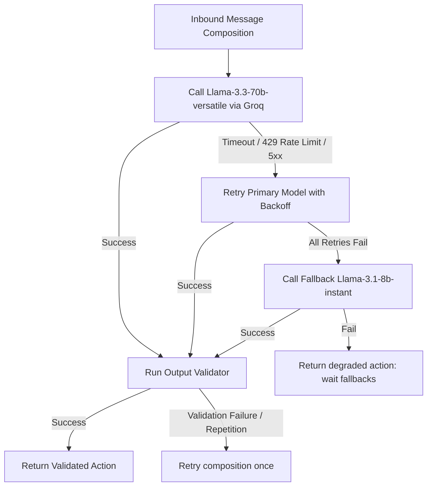

# 🏗️ NEXORA: System Architecture

NEXORA is built on a decoupled, event-driven, high-performance architecture. It separates fast in-memory operational state (Redis) from durable data persistence (MongoDB), utilizing ultra-low latency LLM inference (Groq) for conversational intelligence.

## 🗺️ High-Level System Architecture

## ⏱️ Request Lifecycle: `POST /v1/tick`

The following sequence diagram outlines the end-to-end flow of evaluating triggers and generating engagement actions:

## 🧩 Component Responsibilities

| Component | Responsibility | Interfaces / Technologies |
| :--- | :--- | :--- |
| **`main.py`** | FastAPI App initialization, lifespan management, global exception handling mapping. | FastAPI, Lifespan |
| **`middleware.py`** | Global rate limiting (Redis fixed-window), payload size capping (2MB), request tracing/latency logging. | Starlette Middleware, Redis |
| **`composer/engine.py`** | Coordinates context loading, trigger execution, validation, and action assembly. | EngagementComposer |
| **`composer/trigger_priority_engine.py`** | Deterministically scores and ranks trigger items before sending them to the LLM. | rank_triggers |
| **`composer/prompt_builder.py`** | Tailors LLM system prompts and user payloads for all 27 trigger kinds. | PromptBuilder |
| **`composer/output_validator.py`** | Inspects, auto-corrects, and validates LLM generation schemas and business constraints. | OutputValidator |
| **`reply/handler.py`** | Manages multi-turn conversation replies, auto-replies, and language shifts. | ReplyHandler |
| **`storage/redis_store.py`** | Fast transactional operations (MULTI/EXEC), TTL rate limiting, suppression checks. | Redis (aioredis) |
| **`storage/mongo_store.py`** | Persistent queries, indexing, bulk inserts, historic context logging. | MongoDB (motor) |

## 🛡️ Model Failover & Resiliency Strategy

To satisfy magicpin's strict 30-second budget, NEXORA handles primary model timeouts and rate limits (HTTP 429) using an automated model failover pipeline:

### Async Task Lifecycle & Timeout Boundaries
*   **Total API Timeout (`REPLY_TIMEOUT_SECONDS=28`):** The FastAPI request handler caps the entire lifetime of a `/v1/reply` or `/v1/tick` invocation to prevent gateway timeout errors.
*   **Groq API Timeout (`LLM_TIMEOUT_SECONDS=22`):** Calls to the Groq completion endpoint are constrained to 22 seconds, leaving a 6-second window for failovers and database logging.
*   **Trigger Task Timeout (`TICK_TIMEOUT_SECONDS - 2.0`):** Concurrently executed trigger compositions inside `/v1/tick` are wrapped in individual `asyncio.wait_for` tasks, preventing a single hanging LLM call from aborting other successful generations.

## 🔒 Middleware Stack & Security

1.  **`RateLimitMiddleware`**: Keys client requests by IP + Path using Redis. Enforces a maximum of `1200` global requests per minute. Exempts `/v1/healthz` to prevent liveness check failures.
2.  **`PayloadSizeMiddleware`**: Inspects `Content-Length` headers and rejects payloads exceeding `2MB` with an `HTTP 413 Payload Too Large` JSON payload.
3.  **`RequestLoggingMiddleware`**: Records HTTP method, path, response status, and backend latency (`duration_ms`) in structured format.

## 🛠️ Exception Handler Chain

Global exception mapping guarantees that client errors never expose internal stack traces or raw exceptions, returning structured JSON errors instead:

*   **`RequestValidationError`**: Intercepts Pydantic model validation errors. Special handling for malformed JSON returns an `INVALID_JSON` (HTTP 400) code, while semantic errors return a `VALIDATION_ERROR` (HTTP 422) code.
*   **`StarletteHTTPException`**: Catches common HTTP exceptions (e.g. 404, 405) and wraps them into standard JSON envelopes with descriptive error codes.
*   **`Exception` (Fallback)**: Catches unhandled code crashes, logs the traceback internally, and returns `INTERNAL_ERROR` (HTTP 500) to the client without leaking database names or source codes.

## 💾 Storage Layer Architecture

### Redis Key Spaces

| Key Pattern | Data Type | TTL | Purpose |
| :--- | :--- | :--- | :--- |
| `nexora:ctx_version:{scope}:{context_id}` | `String` | Infinite | Tracks the current active version of a context document. |
| `nexora:ctx_count:{scope}` | `String` | Infinite | Cache count of unique contexts loaded (for `/v1/healthz`). |
| `nexora:suppress:{suppression_key}` | `String` | 7 Days | Deduplicates outgoing messages, preventing fatigue. |
| `nexora:conv:{conversation_id}` | `String` | 30 Days | Stores JSON list of conversation turn history. |
| `nexora:conv_sent:{conversation_id}` | `String` | 30 Days | Stores outgoing messages to check for repetition. |
| `nexora:conv_ended:{conversation_id}` | `String` | 30 Days | Flag indicating a finalized, ended conversation. |
| `nexora:conv_wait_until:{conversation_id}`| `String` | 30 Days | ISO timestamp blocking outreach until the specified date. |
| `nexora:auto_reply_count:{conversation_id}`| `String` | 24 Hours | Integer counting consecutive canned replies. |
| `nexora:ratelimit:{key}:{window}` | `String` | 60 Sec | Sliding window counter for rate limiters. |

### MongoDB Collections

*   **`contexts`**: Active versioned payloads. Has a unique index on `(scope, context_id)`.
*   **`contexts_history`**: Historic versions of context pushes for auditability. Indexed on `(scope, context_id, version)`.
*   **`actions_log`**: Log of all actions generated during `/v1/tick`. Indexed on `logged_at` and `merchant_id`.
*   **`replies_log`**: Log of all reply states and LLM usage statistics. Indexed on `logged_at` and `conversation_id`.
*   **`ticks_log`**: Historical trace of tick payloads and execution order. Indexed on `created_at`.
*   **`suppressions_log`**: Durable record of active suppression keys. Unique index on `suppression_key`.

👉 **Next Steps:** Proceed to the [System Design](/docs/03-system-design.md) manual to review modular breakdowns.
