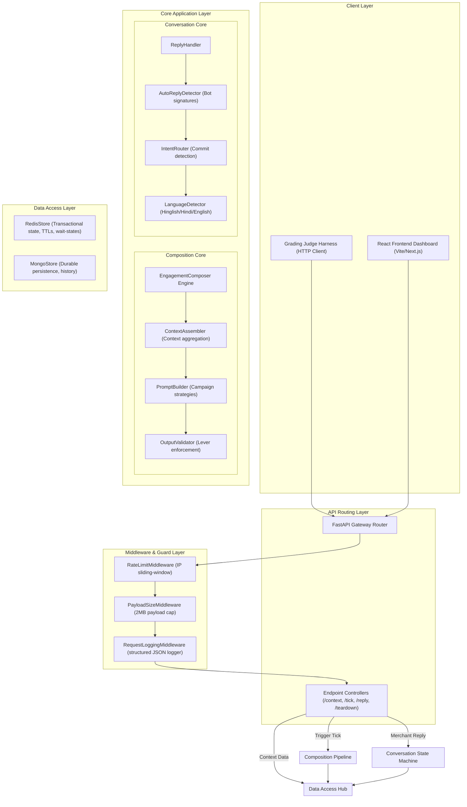
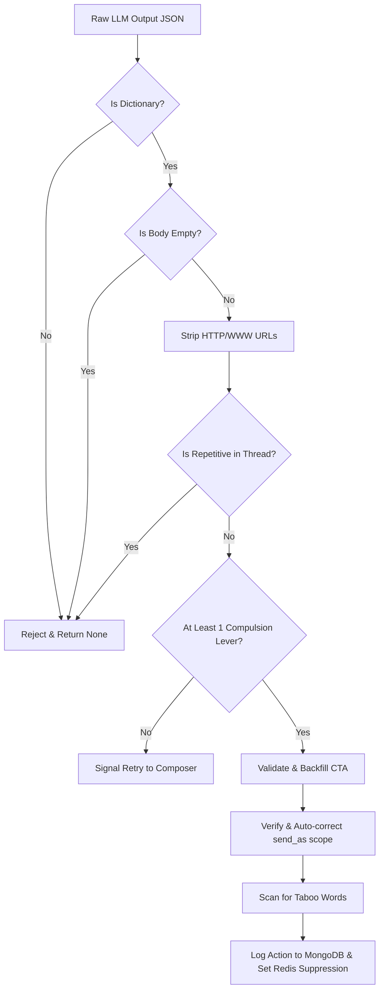
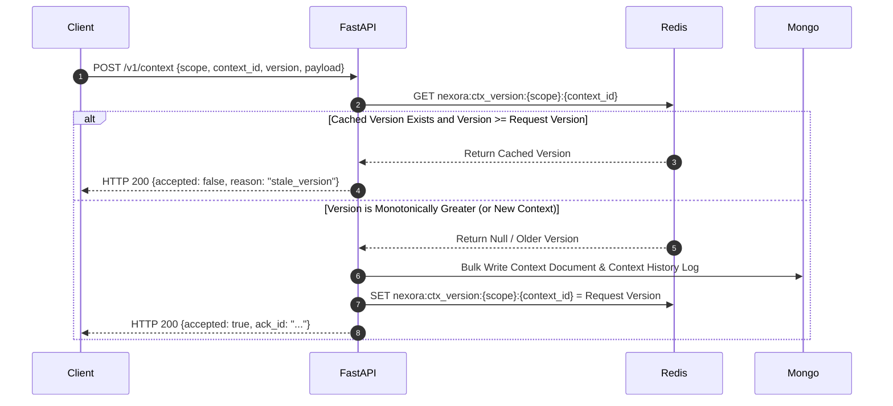

# 🏗️ NEXORA: System Design

NEXORA is designed around modular, decoupled components following Domain-Driven Design (DDD) principles. This ensures separation of concerns, testability, and clean maintainability.

## 🧩 Architectural Modular Breakdown

The system is split into distinct layers:

## ⚙️ Core Subsystem Designs

### 1. Context Assembler
*   **Module:** `backend/composer/context_assembler.py`
*   **Design Pattern:** Facade / Factory
*   **Responsibility:** Given a target `trigger_id` and the current timestamp, it queries MongoDB to retrieve:
    *   The `trigger` context document.
    *   The `merchant` context document referenced by the trigger.
    *   The `category` context document matching the merchant's vertical.
    *   The `customer` context document (only if the trigger has a `customer` scope).
*   **Resilience Logic:** It validates the schema structure. If any critical database context is missing or corrupted, it returns `None` safely instead of raising exceptions, preventing a single corrupted record from halting tick execution.

### 2. Prompt Builder & Dispatcher
*   **Module:** `backend/composer/prompt_builder.py`
*   **Design Pattern:** Strategy Pattern
*   **Responsibility:** Dynamic prompt construction. It injects a global system prompt enforcing general boundaries (no URLs, code-mixing guidance, constraint mapping), and appends trigger-specific system prompts dynamically based on `trigger.kind`.
*   **Prompt Grounding:** Avoids hallucination by structuring raw context data inside markdown blocks (e.g., `## MERCHANT CONTEXT` and `## CUSTOMER CONTEXT`) directly readable by the LLM.

### 3. Output Validation Pipeline
*   **Module:** `backend/composer/output_validator.py`
*   **Design Pattern:** Pipeline / Chain of Responsibility
*   **Responsibility:** Enforces system invariants on raw LLM string completions before delivery.

### 4. Multi-Turn Conversation Manager
*   **Module:** `backend/reply/handler.py`
*   **Design Pattern:** State Pattern
*   **Responsibility:** Drives reply decisions (`send` | `wait` | `end`) using in-memory Redis conversation logs.
*   **Core Detectors:**
    *   `AutoReplyDetector`: Checks for automated WhatsApp responder signatures.
    *   `IntentRouter`: Identifies commit indicators (`"yes"`, `"let's go"`) to skip discovery and enter execution mode.
    *   `LanguageDetector`: Analyzes the inbound message language and directs the LLM to mirror it.

| Inbound User Message | State Machine Transition Action | Redis Status Keys Modified |
| :--- | :--- | :--- |
| **Stop / Unsubscribe** | Transition to `Ended`. Block all future outreach actions. | Set `nexora:conv_ended:{conv_id}` to `True` |
| **Yes / Confirm / Book** | Transition to `ActionMode`. Pass instruction overrides to prompter. | Update latest message intent in `nexora:conv:{conv_id}` |
| **Auto-Reply (Strike 1)** | Generate a gentle nudge prompt to encourage actual human input. | Increment `nexora:auto_reply_count:{conv_id}` |
| **Auto-Reply (Strike 2)** | Transition to `WaitState`. Lock thread and block evaluations for 24 hours. | Set `nexora:conv_wait_until:{conv_id}` with 24h TTL |
| **Auto-Reply (Strike 3)** | Transition to `Ended`. Block conversation thread completely. | Set `nexora:conv_ended:{conv_id}` to `True` |

## 🧬 Design Patterns in Action

NEXORA implements established software engineering patterns to handle complex AI workflow logic cleanly:

*   **Singleton Pattern (Database Connections):** `RedisStore` and `MongoStore` instances are initialized once during the FastAPI application lifecycle and shared across all routing endpoints via FastAPI's dependency injection container, preserving connection pooling efficiency.
*   **Strategy Pattern (Prompt Generation):** `PromptBuilder` uses trigger-specific strategy blocks to customize system instructions and data grounding based on the trigger kind (e.g. chronic refill reminders, competitor alerts, seasonal shift prompts).
*   **Chain of Responsibility (Output Validation):** `OutputValidator` evaluates the generated text through a linear validation pipeline. Each block (URL stripping, repetition checks, lever counts, taboo keyword searches) has the opportunity to sanitise, approve, or reject the message.

## 🔀 Idempotent Ingestion & Monotonic Version Checks

The `/v1/context` ingestion pipeline enforces absolute consistency using the following double-check mechanism:

## 📊 Database Engine Strategy

NEXORA splits data persistence across two datastores:

### 1. Redis (Operational Memory)
Redis acts as a high-throughput, low-latency transaction hub. All context versions are registered in Redis using atomic pipelines (`MULTI/EXEC`) to avoid race conditions. Suppressions, rate limits, and conversation wait-states are enforced using Redis TTL keys to guarantee automatic cleanup.

### 2. MongoDB (System of Record)
MongoDB acts as the durable database. Full context documents are stored as flexible documents, accommodating heterogeneous fields. Every outbound action and inbound reply turn is persistently logged in MongoDB to compile comprehensive dashboards and audit logs.

👉 **Next Steps:** Proceed to the [Data Flow Design](/docs/04-data-flow.md) guide to inspect how data passes through these components.
