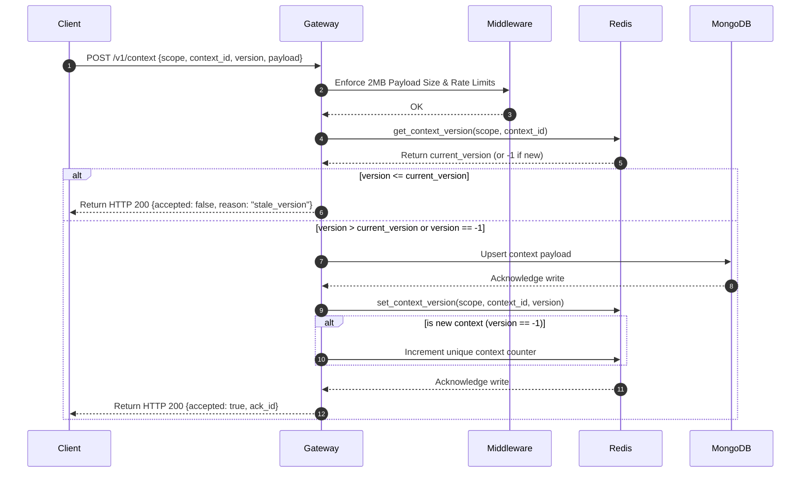
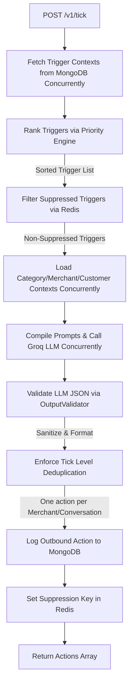
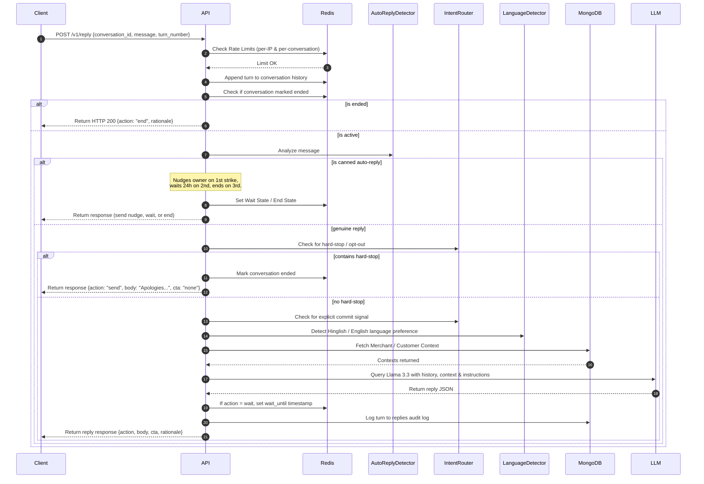

# 🔄 NEXORA: Data Flow Design

This document maps the flow of data through NEXORA’s components during context ingestion, periodic tick execution, and multi-turn reply processing. It highlights the transformation of payloads, transactional memory checks, and persistent audit logging.

## 📥 1. Context Ingestion Flow

The `/v1/context` endpoint handles the ingestion of categories, merchants, customers, and triggers. It uses atomic version checks to guarantee idempotency.

### Ingestion Logic Details
*   **Idempotency & Stale Checks:** When a payload is pushed, the system queries the active version index in Redis first (`nexora:ctx_version:{scope}:{context_id}`). If the inbound version is equal to or less than the cached value, it is rejected immediately with a `stale_version` response, avoiding unnecessary database write operations.
*   **MongoDB Dual Persistence:** Pushes that pass the version check are written to two collections:
    1.  `contexts` collection: Holds only the latest active state (indexed uniquely on `scope` + `context_id`) to ensure rapid querying during trigger evaluation.
    2.  `contexts_history` collection: Appends the historical document version for audit trails and rollback logging.
*   **Redis Version Synchronization:** Upon database confirmation, the new version pointer is written to Redis, updating the cached value. If the update represents a brand new entity, a counter (`nexora:ctx_count:{scope}`) is incremented to dynamically populate liveness status counters on `/v1/healthz`.

## ⏰ 2. Tick Evaluation Flow

The `/v1/tick` endpoint is invoked periodically by the judge harness. It evaluates the available triggers and composes outreach actions.

### Tick Execution Details
*   **Concurrent Context Loading:** Upon receiving a list of active triggers, the engine reads trigger documents from MongoDB concurrently using `asyncio.gather`. 
*   **Deterministic Prioritization:** The Priority Engine calculates a 0-100 score for each trigger based on urgency (1-5 scale), proximity to expiration, commercial value of the trigger kind, internal vs external source, customer vs merchant scope, and payload key count. The triggers are then sorted descending, ensuring high-impact actions are evaluated first.
*   **Deduplication Constraint:** If multiple triggers in the same tick target the same `(merchant_id, conversation_id)` pair, only the highest-priority trigger is processed; subsequent duplicates are skipped.
*   **Redis Suppression Filter:** The sorted list is checked against Redis using `EXISTS` on the suppression keys (`nexora:suppress:{suppression_key}`). Suppressed triggers are dropped from the active queue instantly.
*   **LLM Inference & Validation Pipeline:** For each non-suppressed trigger:
    1.  Category, merchant, and customer contexts are gathered in parallel.
    2.  Prompts are built via `PromptBuilder` and dispatched to the Groq API (fallback to Llama-3.1 if rate-limited).
    3.  Raw JSON strings are parsed by `OutputValidator`, which strips out markdown wrappers and checks for taboo terms.
    4.  The validated action is saved to MongoDB (`actions_log`) and the suppression key is registered in Redis with a 7-day TTL to prevent repeating messages.

## 💬 3. Conversational Reply Flow

The `/v1/reply` endpoint manages ongoing multi-turn customer/merchant threads, routing replies through heuristics before querying the LLM.

### Conversation Handling Details
*   **Thread History State:** Conversation history is serialized as a JSON array string and cached in Redis under `nexora:conv:{conversation_id}`. New replies append to this string.
*   **Auto-Reply Shield (3-Strike Rule):** Automated replies (like out-of-office messages or WhatsApp Business defaults) are intercepted by regex filters. A strike counter (`nexora:auto_reply_count:{conversation_id}`) determines the state:
    *   *Strike 1:* A gentle human nudge message is returned.
    *   *Strike 2:* The thread is locked with a 24-hour wait state (`nexora:conv_wait_until:{conversation_id}`).
    *   *Strike 3:* The thread is permanently marked as ended (`nexora:conv_ended:{conversation_id}`).
*   **Opt-Out & Commit Intent Checks:** The message is parsed for termination intents (e.g., "STOP", "UNSUBSCRIBE", "DND"). If matched, the thread terminates immediately without calling the LLM. If commitment words are matched (e.g., "confirm", "approve"), the handler flags `ActionMode` inside the prompter, bypasses standard discovery, and requests the LLM draft the final campaign checklist.
*   **Bilingual Adaptation:** The `LanguageDetector` determines if the message contains Hindi characters or Hinglish syntax. It dynamically adds instructions to the LLM system prompt requesting the reply match the user's language profile.

👉 **Next Steps:** Proceed to the [API Reference Guide](/docs/05-api-reference.md) to inspect the API schemas.
