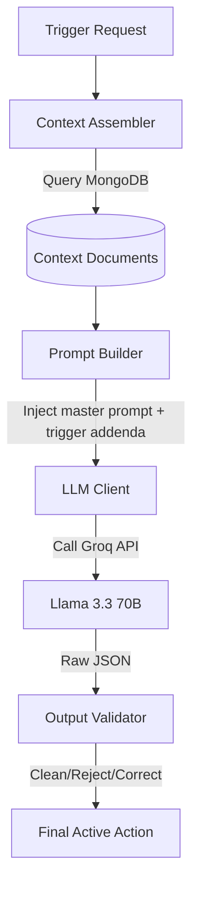
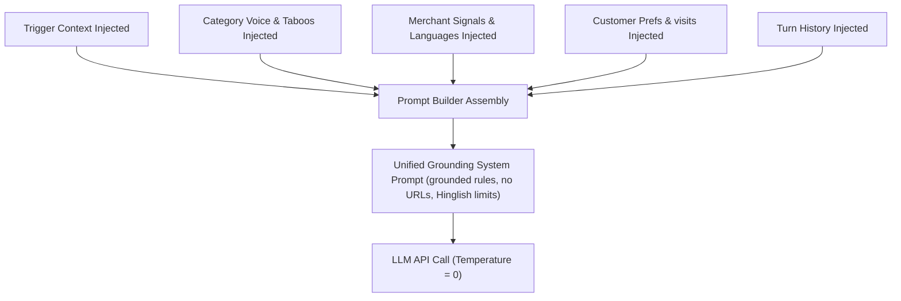
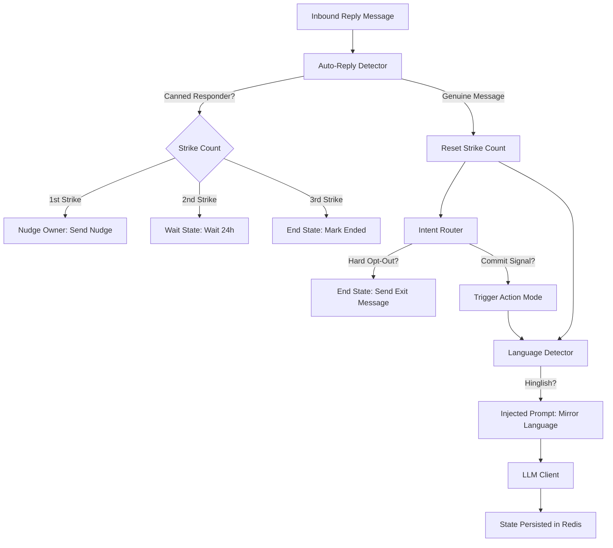

# 🧠 NEXORA: AI Decision Engine

NEXORA’s core intelligence is structured as a pipeline of deterministic pre-processors, isolated LLM prompts, and strict compliance validators.

## 🏎️ Composer Engine Pipeline

The `EngagementComposer` module is responsible for compiling database contexts into formatted prompts, executing Llama 3.3 inference via Groq, and verifying compliance.

### 1. Context Assembler
Combines Category, Merchant, Customer, and Trigger contexts from MongoDB. It verifies timestamps, parses numeric data, and instantiates typed Pydantic models.

### 2. Prompt Builder
Constructs the LLM prompts. It injects the **Master System Prompt** and appends a specialized **Trigger Addendum** depending on the trigger kind (e.g., `research_digest`, `perf_dip`, `recall_due`).

### 3. LLM Client
Queries the Groq API using `llama-3.3-70b-versatile` ($T = 0$, `max_tokens: 600`).
*   **Timeout Handling:** Includes a strict 22-second timeout.
*   **Failover Logic:** If the primary Groq model fails or times out, it automatically retries with a fallback model (`llama-3.1-8b-instant`).

### 4. Output Validator
Enforces the challenge contract on raw LLM JSON strings:

| Check | Target | Behavior on Failure |
| :--- | :--- | :--- |
| **Empty Check** | `body` field | Rejects composition (returns `None`). |
| **URL Stripping** | URLs/Bare `www.` links | Strips URLs, normalizes whitespace. |
| **Anti-Repetition** | Message history duplication | Rejects body if sent in the same conversation thread. |
| **Compulsion Levers** | Presence of $\ge 1$ levers | Flags missing levers and retries composition. |
| **CTA Validation** | Must match `VALID_CTAS` | Default fall back to `"open_ended"`. |
| **Send As Correction** | Customer-scope vs Merchant-scope | Auto-corrects mismatch based on scope. |
| **Taboo Vocabulary** | Detects category forbidden words | Logs warning (allows delivery to avoid false positives). |
| **Params Backfilling**| `template_params` list | Populates parameters list automatically from merchant state. |
| **Params Limitation**| Number of variables | Caps `template_params` list to at most 3 items (SLA requirement). |
| **Rationale Backfill**| `rationale` description | Backfills missing rationale string. |

## 🧭 Prompt Ingestion & Structure Design

NEXORA prevents hallucinations and anchors LLM reasoning using structured context injection blocks. The prompter merges components into a single instruction set:

### Prompt Grounding Segments
*   **Role Identification:** Defines if the bot acts as `nexora` (merchant-facing platform) or `merchant_on_behalf` (customer-facing brand voice).
*   **Core Grounding Rules:** Restricts LLM from creating external offers, mentions limits on URL generation (prohibited), and specifies Devanagari Hindi or Hinglish code-mix constraints depending on client preference.
*   **Historical Context Injection:** Injects past turns directly into the prompter to ensure semantic anti-repetition.

## ⚡ Compulsion Levers

NEXORA’s prompt structure ensures that generated outreach utilizes behavioral psychology levers. The validator evaluates message content using keyphrase mapping:

| Psychology Lever | Keyphrase Tokens Map |
| :--- | :--- |
| **Urgency** | `urgent`, `immediately`, `now`, `today`, `tonight`, `this week`, `right now`, `asap`, `abhi`, `aaj` |
| **Scarcity** | `limited`, `only`, `few left`, `running out`, `last slot`, `slots left`, `sirf`, `akhri` |
| **Loss Aversion** | `miss`, `losing`, `lose`, `decline`, `down`, `dip`, `behind`, `gap`, `chhoot`, `nuksaan` |
| **Commitment** | `reply yes`, `reply confirm`, `say yes`, `say go`, `just reply`, `confirm to`, `haan bolein` |
| **Deadline** | `deadline`, `expires`, `expir`, `by`, `before`, `within`, `days left`, `hours left`, `due` |
| **Social Proof** | `dentist`, `salon`, `gym`, `similar`, `peer`, `locality`, `nearby`, `top`, `most`, `popular` |
| **Specificity** | `%`, `₹`, `rs.`, `inr`, `patients`, `customers`, `views`, `calls`, `reviews`, `ctr` |
| **Effort Externalization**| `drafted`, `ready`, `i have`, `let me`, `i will`, `prepared`, `built`, `kar diya`, `taiyaar` |

## 📊 Trigger Priority Engine

Before calling the LLM, the priority engine ranks active triggers using a deterministic 0-100 score:

$$\text{Priority Score} = S_{\text{urgency}} + S_{\text{expiry}} + S_{\text{kind}} + S_{\text{source}} + S_{\text{scope}} + S_{\text{payload}}$$

### Scoring Dimension Details
*   **Urgency ($S_{\text{urgency}}$, Max 25):** Evaluated as `trigger.urgency * 5`. An urgency of 5 gives 25 points.
*   **Expiry ($S_{\text{expiry}}$, Max 25):** Calculates simulated hours remaining before the trigger expires. If hours $\le 24$ (critical proximity), it scores a full 25 points. If hours $\ge 168$ (1 week), it scores 0 points. Triggers with no expiry get a neutral 12 points.
*   **Kind Weight ($S_{\text{kind}}$, Max 20):** Based on business value weights (e.g. `supply_alert` = 20, `appointment_tomorrow` = 18, `research_digest` = 8).
*   **Source ($S_{\text{source}}$, Max 10):** `external` triggers represent third-party customer action, receiving 10 points. `internal` triggers receive 6 points.
*   **Scope ($S_{\text{scope}}$, Max 10):** `customer` scoped events represent direct revenue opportunities, receiving 10 points. `merchant` scoped updates receive 7 points.
*   **Payload ($S_{\text{payload}}$, Max 10):** Evaluated as `len(payload.keys()) * 2`, capped at 10 points. Richer context signals receive higher scores.

*Ties are broken using the trigger ID lexicographic order to guarantee determinism.*

## 🔄 Reply Handler Pipeline

The `/v1/reply` endpoint manages ongoing, multi-turn conversations using a modular state machine:

### Auto-Reply Detector (Three-Strike Rules)
Prevents infinite loops with automated WhatsApp Business canned responders:
1.  **Strike 1:** Sends a nudge: *"Looks like an auto-reply. Please reply Yes to continue."*
2.  **Strike 2:** Enters a wait state, setting a 24-hour block in Redis.
3.  **Strike 3:** Enters an ended state, terminating the thread.

### Intent Router
*   **Hard Stop:** Matches keywords like `"stop"`, `"not interested"`, `"unsubscribe"`. Triggers a polite final message and closes the thread.
*   **Commit Transition:** Matches affirmative phrases like `"yes"`, `"let's do it"`, `"go ahead"`. Signals the LLM to transition to *Action Mode* (delivers drafts immediately, skipping further exploratory questions).

### Language Detector
Detects if the message is written in Hindi/Hinglish and tells the LLM to mirror the language in its response.

## 📋 Trigger Kinds & Weights Configuration

NEXORA supports 27 trigger kinds with distinct configurations:

| Trigger Kind | Kind Weight | Send As Target | Default CTA Type |
| :--- | :---: | :--- | :--- |
| `supply_alert` | 20 | `merchant_on_behalf` | `binary_yes_no` |
| `regulation_change` | 20 | `nexora` | `binary_yes_no` |
| `appointment_tomorrow` | 18 | `merchant_on_behalf` | `binary_confirm_cancel` |
| `recall_due` | 18 | `merchant_on_behalf` | `multi_choice_slot` |
| `chronic_refill_due` | 18 | `merchant_on_behalf` | `binary_yes_no` |
| `renewal_due` | 16 | `nexora` | `binary_yes_no` |
| `perf_spike` | 15 | `nexora` | `binary_yes_no` |
| `perf_dip` | 14 | `nexora` | `binary_yes_no` |
| `seasonal_perf_dip` | 14 | `nexora` | `binary_yes_no` |
| `competitor_opened` | 14 | `nexora` | `open_ended` |
| `customer_lapsed_hard` | 13 | `merchant_on_behalf` | `binary_yes_no` |
| `ipl_match_today` | 13 | `nexora` | `binary_yes_no` |
| `winback_eligible` | 12 | `merchant_on_behalf` | `binary_yes_no` |
| `bridal_followup` | 12 | `merchant_on_behalf` | `binary_yes_no` |
| `wedding_package_followup`| 12 | `merchant_on_behalf` | `binary_yes_no` |
| `festival_upcoming` | 12 | `nexora` | `binary_yes_no` |
| `trial_followup` | 11 | `merchant_on_behalf` | `binary_yes_no` |
| `customer_lapsed_soft` | 10 | `merchant_on_behalf` | `binary_yes_no` |
| `category_seasonal` | 10 | `nexora` | `binary_yes_no` |
| `milestone_reached` | 9 | `nexora` | `open_ended` |
| `review_theme_emerged` | 9 | `nexora` | `binary_yes_no` |
| `gbp_unverified` | 9 | `nexora` | `binary_yes_no` |
| `cde_opportunity` | 9 | `nexora` | `open_ended` |
| `research_digest` | 8 | `nexora` | `open_ended` |
| `active_planning_intent` | 8 | `merchant_on_behalf` | `binary_confirm_cancel` |
| `dormant_with_nexora` | 6 | `nexora` | `binary_yes_no` |
| `curious_ask_due` | 5 | `nexora` | `open_ended` |

👉 **Next Steps:** Review the [Deployment Guide](/docs/08-deployment.md) to initialize the service locally.
