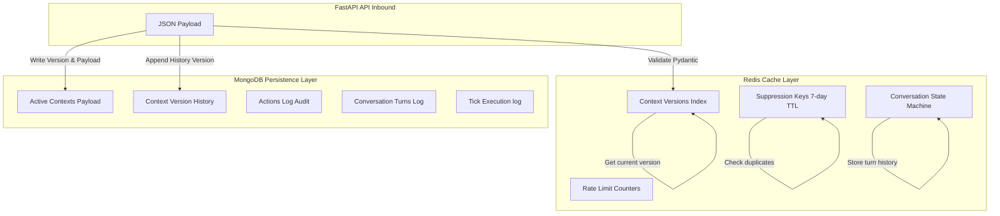
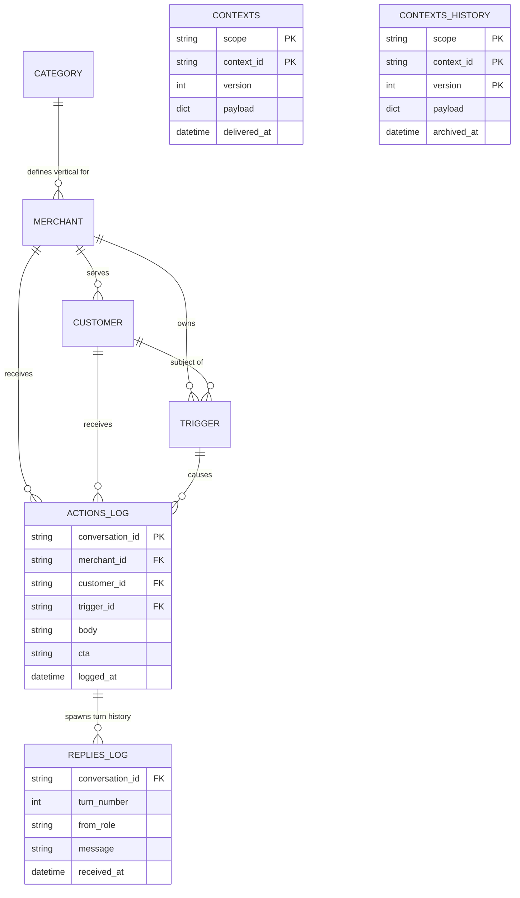

# 🗃️ NEXORA: Data Schema & Models

This document specifies the internal data schemas, Pydantic validation models, Redis cache structures, and MongoDB persistence layouts.

## 🗺️ Data Responsibilities

NEXORA divides its data layer into two distinct responsibilities: fast transient operational cache (Redis) and durable history audit trail (MongoDB).



## 📊 Database Schema Entity-Relationship (ER) Model

The following ER diagram maps the MongoDB collection structures, primary keys, foreign key references, and multi-dimensional operational relationships:



## 📝 Request / Response Models

NEXORA utilizes Pydantic (v2) models to validate incoming HTTP payloads and format outgoing JSON structures.

### 1. `ContextBody` (Ingested via `POST /v1/context`)

Validates incoming context registration requests.

| Parameter | Type | Validation Rules | Description |
| :--- | :--- | :--- | :--- |
| `scope` | `String` | Must be one of `['category', 'merchant', 'customer', 'trigger']`. | Scope of the context. |
| `context_id` | `String` | Cannot be blank or empty whitespace. | Unique identifier. |
| `version` | `Integer`| Must be $\ge 0$. | Monotonically increasing version. |
| `payload` | `Object` | Any valid JSON dictionary. | The core configuration data. |
| `delivered_at`| `String` | Must be a valid ISO 8601 timestamp. | Time context was dispatched. |

### 2. `TickBody` (Ingested via `POST /v1/tick`)

Trigger evaluation request structure.

| Parameter | Type | Validation Rules | Description |
| :--- | :--- | :--- | :--- |
| `now` | `String` | Must be a valid ISO 8601 timestamp. | Simulated evaluation timestamp. |
| `available_triggers` | `Array` | List of non-empty trigger strings. | Trigger IDs to evaluate. |

### 3. `ReplyBody` (Ingested via `POST /v1/reply`)

Conversational turn response body.

| Parameter | Type | Validation Rules | Description |
| :--- | :--- | :--- | :--- |
| `conversation_id` | `String` | Cannot be blank or empty whitespace. | Tracking ID for the thread. |
| `merchant_id` | `String` | Optional. Checked against MongoDB if present. | Target merchant ID. |
| `customer_id` | `String` | Optional. Checked against MongoDB if present. | Target customer ID. |
| `from_role` | `String` | Must be one of `['merchant', 'customer']`. | Message sender. |
| `message` | `String` | Cannot be blank or empty whitespace. | Text contents of the turn. |
| `received_at` | `String` | Must be a valid ISO 8601 timestamp. | Time message was received. |
| `turn_number` | `Integer`| Must be $\ge 1$. | Incrementing counter. |

## 💾 MongoDB Collections Layout & Indexing Rationale

MongoDB serves as the persistent system of record. Compound and unique indexing strategies are applied to optimize query latency and ensure data constraints:

### 1. Collection: `contexts`
Durable system of record for active contexts.
*   **Indexes:** Unique index on `(scope, context_id)` (Ascending) named `scope_context_id_unique`. This index prevents duplicate context scopes and supports instant lookups during context assembly.

### 2. Collection: `contexts_history`
Durable audit log of all historical context pushes.
*   **Indexes:** Compound index on `(scope, context_id, version)` (Descending). This index speeds up historical version audits.

### 3. Collection: `actions_log`
Log of every action composed during a tick.
*   **Indexes:**
    *   Index on `logged_at` (Descending) named `logged_at_desc` (supports sorting recent actions on the dashboard).
    *   Index on `merchant_id` (Ascending) named `merchant_id_idx` (supports merchant-level filter queries).
    *   Index on `trigger_id` (Ascending) named `trigger_id_idx`.

### 4. Collection: `replies_log`
Audit history of multi-turn reply turns and state transitions.
*   **Indexes:**
    *   Index on `logged_at` (Descending) named `replies_logged_at_desc`.
    *   Index on `conversation_id` (Ascending) named `replies_conv_id_idx` (enables thread fetching for dashboard visualizations).

### 5. Collection: `suppressions_log`
Durable mirror of active Redis suppression keys.
*   **Indexes:** Unique index on `suppression_key` (Ascending).

## ⚡ Redis Key Space Layout

Operational transient values are mapped to Redis keys with explicit eviction boundaries:

| Pattern | Type | TTL | Purpose |
| :--- | :--- | :--- | :--- |
| `nexora:ctx_version:{scope}:{id}` | `String` | Infinite | Holds the current active version index for idempotency version check. |
| `nexora:ctx_count:{scope}` | `String` | Infinite | Cached unique counter of scopes loaded for `/v1/healthz`. |
| `nexora:suppress:{key}` | `String` | 7 Days | Blocks duplicate ticks (`POST /v1/tick`) within 7-day fatigue window. |
| `nexora:conv:{conversation_id}` | `String` | 30 Days | Holds turn history JSON string (serialised array of turn dicts). |
| `nexora:conv_sent:{conversation_id}` | `String` | 30 Days | Holds recently sent message body strings to enforce semantic anti-repetition. |
| `nexora:conv_ended:{conversation_id}` | `String` | 30 Days | Boolean flag blocking further turns in ended conversation threads. |
| `nexora:conv_wait_until:{id}` | `String` | 30 Days | ISO timestamp blocking proactive trigger outreach (wait state machine). |
| `nexora:auto_reply_count:{id}` | `String` | 24 Hours | Integer counting consecutive canned response strikes (auto-reply shield). |
| `nexora:ratelimit:{key}:{window}`| `String` | 60 Sec | Sliding window counter for rate limiters (expires automatically after 60s). |
| `nexora:start_time` | `String` | Infinite | Stores server start timestamp to compute liveness uptime metrics. |

## 🧩 Context Payload Specifications

The four scope structures expected by `/v1/context`:

### 1. Scope: `category`

Defines category-level characteristics, voice guidelines, and seasonal beats.

```json
{
  "slug": "dentists",
  "voice": {
    "tone": "clinical",
    "register": "clinical-peer",
    "vocab_allowed": ["clinical", "treatment", "hygiene", "retention"],
    "vocab_taboo": ["cheap", "discount", "guarantee", "freebie"]
  },
  "peer_stats": {
    "avg_ctr": 0.045,
    "avg_rating": 4.3
  },
  "seasonal_beats": [
    {
      "period": "Nov-Feb",
      "note": "Nov-Feb exam-stress bruxism spike",
      "uplift_pct": 30
    }
  ],
  "digest": [
    {
      "id": "digest_dent_001",
      "title": "Fluoride recall frequency clinical trial",
      "source": "JIDA Oct 2026 p.14",
      "kind": "research",
      "trial_n": 2100,
      "patient_segment": "high-risk adults",
      "summary": "3-month recall cuts caries recurrence 38% better than 6-month."
    }
  ],
  "trend_signals": [
    {
      "query": "teeth whitening seasonal preparation",
      "index": 85
    }
  ]
}
```

### 2. Scope: `merchant`

Specifies the merchant's business details, offerings, and aggregate performance.

```json
{
  "id": "m_dentist_01",
  "identity": {
    "name": "Metro Dental Care",
    "owner_first_name": "Sanjay",
    "city": "Delhi",
    "locality": "Connaught Place",
    "languages": ["en", "hi"]
  },
  "subscription": {
    "plan": "gold",
    "status": "active",
    "days_remaining": 45
  },
  "performance": {
    "views": 1200,
    "calls": 45,
    "directions": 23,
    "ctr": 0.038,
    "leads": 12,
    "delta_7d": {
      "views_pct": 12.5,
      "calls_pct": -3.2
    }
  },
  "offers": [
    {
      "title": "Complimentary Dental Scan",
      "status": "active"
    }
  ],
  "signals": ["low_ctr", "high_lapsing"],
  "customer_aggregate": {
    "total_unique_ytd": 340,
    "lapsed_180d_plus": 78,
    "retention_6mo_pct": 0.62,
    "high_risk_adult_count": 45
  },
  "conversation_history": []
}
```

### 3. Scope: `customer`

Durable profile for individual end-consumers.

```json
{
  "id": "cust_dent_901",
  "identity": {
    "name": "Amit Sharma",
    "language_pref": "hi-en",
    "age_band": "25-34"
  },
  "state": "active",
  "relationship": {
    "visits_total": 4,
    "last_visit": "2026-04-15",
    "services_received": ["teeth cleaning", "consultation"]
  },
  "preferences": {
    "preferred_slots": "evening"
  },
  "consent": {
    "scope": ["whatsapp"]
  }
}
```

### 4. Scope: `trigger`

Specific signal requiring outreach composition.

```json
{
  "id": "trg_dent_901_recall",
  "kind": "recall_due",
  "urgency": 4,
  "scope": "customer",
  "source": "internal",
  "merchant_id": "m_dentist_01",
  "customer_id": "cust_dent_901",
  "suppression_key": "sup_recall_cust_dent_901",
  "expires_at": "2026-07-31T23:59:59Z",
  "payload": {
    "available_slots": ["Monday 6PM", "Wednesday 7PM"]
  }
}
```

👉 **Next Steps:** Proceed to the [Overview Guide](/docs/01-overview.md) to inspect higher-level interactions.
