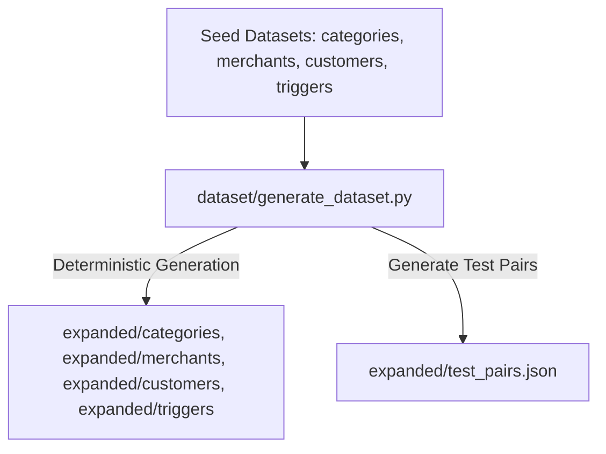
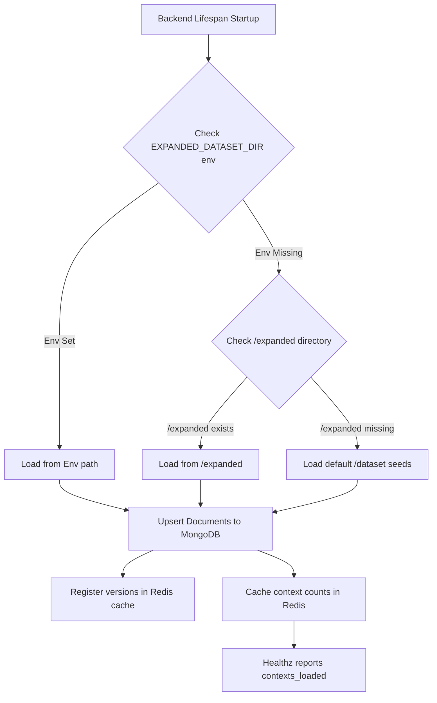

# 📊 Dataset & Preloading

This document explains the structure of the Magicpin VERA challenge dataset, the mock data generator, and the automated startup preload mechanism.

## 🗃️ Dataset Architecture

The project dataset contains five verticals (categories), populated with mock merchants, customers, triggers, and evaluation test cases:

```
dataset/
  ├── categories/
  │     ├── dentists.json       # Vertical configuration (taboo, tones, peer stats)
  │     ├── gyms.json
  │     ├── pharmacies.json
  │     ├── restaurants.json
  │     └── salons.json
  ├── merchants_seed.json        # Base merchant templates
  ├── customers_seed.json        # Base customer templates
  ├── triggers_seed.json         # Base trigger event templates
  └── generate_dataset.py        # Seed expansion generator
```

## 📐 Expanded Context Schema Details

Each of the four scopes maps to a concrete schema loaded into MongoDB:

### 1. Category Context
Contains slow-moving configurations and business rules shared across all merchants in a vertical.
*   `slug`: String (e.g. `"dentists"`, `"salons"`).
*   `voice`: Configuration defining `tone`, `register`, `vocab_allowed` list, and `vocab_taboo` list.
*   `peer_stats`: Reference statistics like `avg_ctr` and `avg_rating`.
*   `seasonal_beats`: List of seasonal events with period, description, and uplift percentages.
*   `digest`: Academic research, regulatory updates, or trend summaries.
*   `trend_signals`: Real-time keywords and search indices.

### 2. Merchant Context
Captures specific merchant profiles, subscription metrics, and current performance snapshots.
*   `merchant_id`: Unique string ID.
*   `identity`: Business name, owner's first name, city, locality, and list of supported languages (e.g. `["en", "hi"]`).
*   `subscription`: Plan name (gold/silver/platinum), status (active/paused), and remaining days.
*   `performance`: Clicks, views, calls, directions, CTR, and 7-day delta metrics.
*   `offers`: Active customer deals from their portfolio.
*   `customer_aggregate`: Retention rates, lapsed counts, and total visits.
*   `signals`: Derived health statuses (e.g. `low_ctr`, `high_lapsing`).

### 3. Customer Context
Individual consumer preference profiles linked to merchants.
*   `customer_id`: Unique string ID.
*   `identity`: Customer name, preferred communication language, and age group.
*   `relationship`: Visit counts, last visit date, and list of services received.
*   `preferences`: Preferred slot booking windows (e.g. morning/evening).
*   `consent`: Communication channels accepted.

### 4. Trigger Context
Transient event payload requiring immediate action compilation.
*   `trigger_id`: Unique string ID.
*   `kind`: Trigger business type (e.g. `supply_alert`, `recall_due`).
*   `urgency`: Numerical priority rating (1 to 5).
*   `scope`: Scope classification (`merchant` or `customer`).
*   `source`: Dispaching source (`internal` or `external`).
*   `suppression_key`: deduplication suppression tag.
*   `expires_at`: ISO timestamp when the event expires.
*   `payload`: Trigger-specific parameters (e.g. custom product alert details, peer dips).

## ⚙️ Seed Expansion Generator

To generate a full test suite database, the Python generator script expands these templates into a structured set of contexts:

*   **Location:** `dataset/generate_dataset.py`
*   **Expansion Target:** 5 categories, 50 merchants, 200 customers, 100 triggers.
*   **Test Cases:** Compiles `test_pairs.json` containing 30 canonical (trigger, merchant, customer) test pairs.
*   **Expansion Seed:** Fixed seed `20260426` ensuring everyone generates the exact same dataset.
*   **Variation Logic:** Shuffles owner names, business names, localities across 10 Indian cities (Delhi, Mumbai, Bangalore, Chennai, etc.), and assigns local performance metrics.



## 🚀 Preloading Database Ingestion

At backend startup, NEXORA resolves the dataset path and preloads all contexts into MongoDB, ensuring they are registered before evaluation begins.



### Ingestion Logic
1.  **MongoDB Upsert:** Iterates through category, merchant, customer, and trigger directories, saving document JSONs to the `contexts` collection using a unique compound index on `(scope, context_id)` to prevent duplication.
2.  **Redis Cache Synchronization:** Sets the current context version to `1` in Redis using `set_context_version_if_new` to sync the cache.
3.  **Unique Count Increment:** Increments the unique context counter in Redis so `/v1/healthz` accurately displays context counts instantly without hitting MongoDB on every probe.

## 📄 Test Pairs Structure

The generated `expanded/test_pairs.json` contains a list of 30 test configurations. Each entry binds a trigger to a merchant and customer:

```json
[
  {
    "trigger_id": "trg_001_recall_due",
    "merchant_id": "m_001_drmeera_dentist_delhi",
    "customer_id": "cust_dent_001",
    "category": "dentists",
    "expected_action": "send",
    "expected_cta": "multi_choice_slot"
  }
]
```

These pairs are used by the test suite and evaluation scripts to verify API compliance and output formatting.

👉 **Next Steps:** Proceed to the [Testing Framework](/docs/11-testing.md) to run the automated validation suite.
