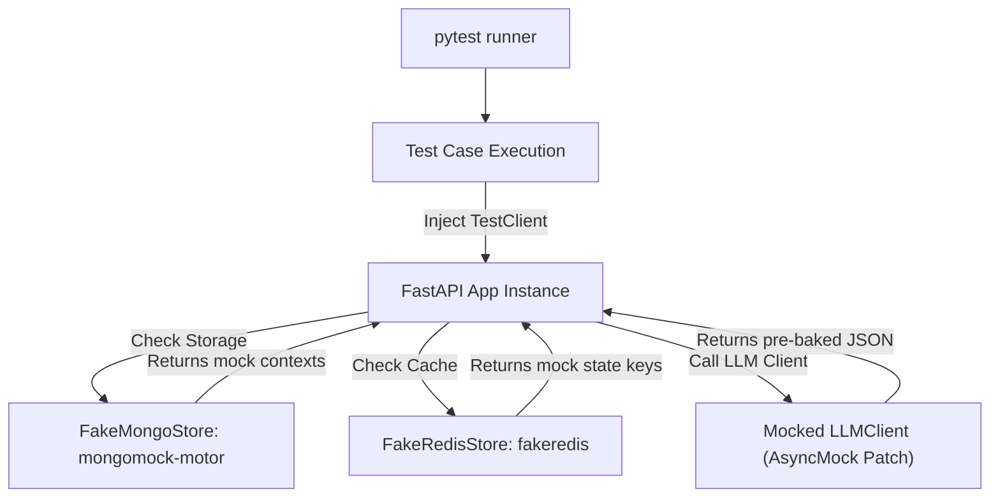
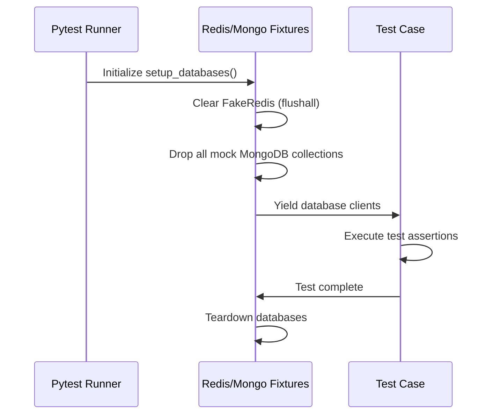

# 🧪 Testing & Validation Framework

NEXORA features a comprehensive test suite designed to run in isolation without requiring external database services or API endpoints.

## 🎛️ Test Architecture

To support isolated testing (e.g., in CI/CD pipelines or local sandboxes), the test suite replaces external database systems and web services with in-memory test doubles:



*   **Mock LLM Clients:** Real network calls to Groq are mocked at the `LLMClient.complete` boundary using Python’s `unittest.mock.patch` and `AsyncMock`, returning compliant mock JSON payloads instantly.
*   **Storage Mocks:** MongoDB is mocked via `mongomock_motor`, creating a complete, non-persistent, in-memory MongoDB environment. Redis is mocked using `fakeredis`, simulating TTL counters, key value mappings, and multi-key transactions.

## 📋 Test Modules & Coverage

The test suite contains **101 tests (100% passing)** across the following files:

| Test File | Description | Target Capabilities |
| :--- | :--- | :--- |
| **`test_api_integration.py`** | E2E API endpoint tests. | `/v1/context` pushes, `/v1/tick` evaluation, `/v1/reply` turn processing. |
| **`test_demo_mode.py`** | Validates demo state overrides. | Verification that `DEMO_MODE=true` bypasses 7-day suppression and wait states. |
| **`test_error_handling.py`** | Input validation test cases. | Validates HTTP 400 on malformed JSON, HTTP 404 on missing triggers/merchants/customers, and HTTP 413. |
| **`test_new_features.py`** | Validates upgrade endpoints. | Tests `/v1/demo/reset`, `processing_ms` injection, and `/v1/action/{id}/explain`. |
| **`test_output_validator.py`**| Validates compliance checks. | URL stripping, taboo word warnings, and anti-repetition guards. |
| **`test_prompt_builder.py`** | Verifies prompt construction. | Test system prompt layout, language code-mixing instructions, and trigger addenda. |
| **`test_regressions.py`** | Regression test cases. | Verifies simulated time checks and database ping exceptions. |
| **`test_reply_detectors.py`**| Tests conversational heuristics. | Auto-reply strings, hard-stop indicators, and language preferences. |
| **`test_storage_integration.py`**| Exercises database adapters. | Redis cache counters, version changes, and Mongo action logging. |
| **`test_teardown_and_dedup.py`**| Verifies teardown execution. | Database wiping, context drops, and tick deduplication. |
| **`test_wait_and_ratelimit.py`**| Verifies traffic enforcement. | Conversation wait limits, rate-limit buckets, and blocked turns. |
| **`test_warmup_and_test_pairs.py`**| Simulates judge warmup. | Ingestion of 255 warmup contexts, verifying that all 30 test pairs yield valid actions. |

## ⚙️ Fixture & Setup Lifecycle

Pytest fixtures manage clean database state transitions between tests automatically:



*   **State Isolation:** Every test case starts with a blank slate in both `fakeredis` and `mongomock_motor` to prevent side effects and cross-test contamination.
*   **FastAPI Client Mocking:** FastAPI endpoints are queried using a standard `TestClient` or `AsyncClient`, validating request/response serialization under production conditions.

## 🏃 Execution Instructions

To execute the test suite locally:

1.  **Activate Virtual Environment:**
    ```bash
    cd backend
    source venv/bin/activate # Windows: venv\Scripts\activate
    ```

2.  **Run Pytest:**
    ```bash
    pytest tests/ -v
    ```

### Useful Pytest Flags
*   **Run specific test file:**
    ```bash
    pytest tests/test_output_validator.py -v
    ```
*   **Filter tests by name (e.g. only test wait state logic):**
    ```bash
    pytest -k "wait" -v
    ```
*   **Stop execution on first failure:**
    ```bash
    pytest tests/ -x
    ```

## 🛠️ Troubleshooting & Issue Mitigation

The following table lists common runtime problems, their root causes, and step-by-step solutions for verifying NEXORA.

| Problem | Cause | Solution | Example | Expected Output |
| :--- | :--- | :--- | :--- | :--- |
| **`HTTP 413 Payload Too Large`** | Ingested context body exceeds `500KB` cap, or request payload > `2MB` middleware limit. | Split context payloads into smaller documents or reduce log sizes before pushing. | `POST /v1/context` with 600KB payload | `{"success": false, "reason": "payload_too_large", ...}` |
| **`stale_version` rejection** | The version number in `POST /v1/context` is less than or equal to the version cached in Redis. | Increment the version parameter in the context push request. | `POST /v1/context` with `version: 1` when version 2 is loaded | `{"accepted": false, "reason": "stale_version", ...}` |
| **`POST /v1/tick` returns `{"actions": []}`** | Triggers are suppressed by active keys in Redis, wait states are active, or triggers are expired. | Enable `DEMO_MODE=true` to bypass checks, or call `/v1/demo/reset` to clear suppression keys. | Running tick twice on `trg_001` in production mode | `{"actions": [], "processing_ms": 1.4}` |
| **`POST /v1/reply` returns wait action** | Automated WhatsApp Business responder triggered the auto-reply detector. | Send a genuine text message to reset the auto-reply counter in Redis. | Sending canned auto-reply message twice | `{"action": "wait", "wait_seconds": 86400, ...}` |
| **`HTTP 429 Rate Limit Exceeded`** | Client request rate exceeded global limits (1,200/min) or conversation limits (10/min). | Throttle client requests. Wait 60 seconds for the window counter to reset. | Exceeding 10 messages in a minute for a conversation thread | `{"detail": "Rate limit exceeded. Please slow down."}` |
| **`HTTP 404 TRIGGER_NOT_FOUND`** | Trigger ID in tick list does not exist in MongoDB contexts collection. | Push the trigger context via `POST /v1/context` before executing the tick event. | `POST /v1/tick` referencing `"trg_missing"` | `{"success": false, "error": {"code": "TRIGGER_NOT_FOUND", ...}}` |
| **Groq API 500 error** | Invalid or missing `GROQ_API_KEY` in environment. | Set a valid Groq API key in your `.env` configuration file. | Running tick without configuring the api key | `{"success": false, "reason": "internal_error", ...}` |
| **MongoDB ping failure** | MongoDB instance is offline or unreachable. | Verify the MongoDB container is running and check `MONGO_URI` connection strings. | Outage causing `/v1/healthz` degradation | `{"status": "degraded", "mongo_connected": false, ...}` |

👉 **Next Steps:** Proceed to the [Future Roadmap Guide](/docs/12-future-roadmap.md) to inspect directory layouts.
