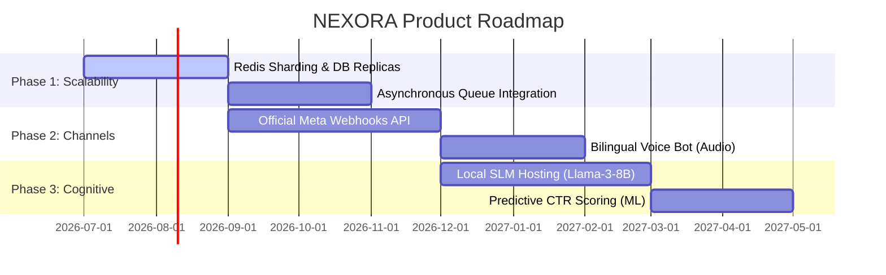
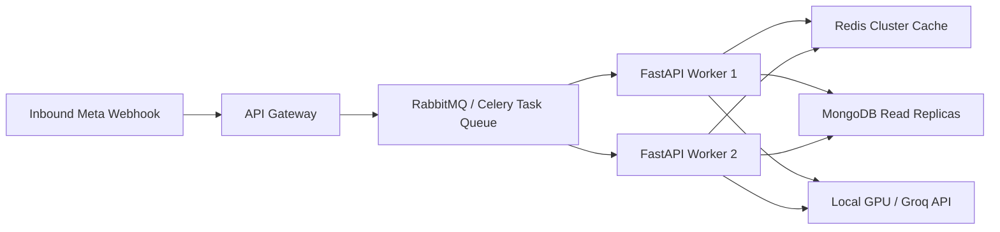

# 🗺️ NEXORA: Future Roadmap

This document outlines planned improvements for scalability, WhatsApp integration, advanced cognitive workflows, and predictive modeling for NEXORA.

## 📅 Product Roadmap Gantt

The timeline below maps our three primary developmental phases to future implementation cycles:

## 📈 Scalability & High Throughput

To scale the system beyond the current evaluation scope, future iterations will implement:

*   **Redis Cluster:** Sharding suppression keys, rate-limit buckets, and conversation threads across a Redis Cluster to handle thousands of concurrent requests without locking.
*   **MongoDB Read Replicas:** Routing write operations (context pushes, audit logs) to primary MongoDB nodes, and read queries (context loading) to secondary replicas to scale datastore throughput.
*   **Asynchronous Message Queues:** Replacing inline HTTP calls with task queues (e.g. Celery or RabbitMQ) to process ticks and replies asynchronously.

## 💬 Official WhatsApp Integration & Multimodal Pipeline

Currently, NEXORA acts as a cognitive routing layer. The production integration plan with Meta's official APIs includes:

*   **Webhook Listener:** Implement a FastAPI route to parse Meta’s inbound WhatsApp messaging events.
*   **Meta Template Registration:** Map generated CTA formats (`binary_yes_no`, `multi_choice_slot`) directly to registered WhatsApp Interactive Messages (Quick Replies and List Messages).
*   **Audio Transcription Pipeline (Whisper):** Transcribes inbound voice notes (Hinglish/Hindi/English) into text before intent routing.
    *   *Acoustic Translation:* Leverages Whisper API to convert romanized Hindi sound waves into Hinglish Unicode.
    *   *Language Match:* Feeds transcriptions directly into our existing language detector block.
*   **Visual Sanitizer (Vision LLM):** Scans photos of merchant storefronts, menu cards, and flyers. Extracts details (prices, offers, working hours) and uploads them as updated merchant contexts automatically.

## 🧠 Advanced Cognitive Workflows

### 1. Vector RAG Compliance Schema
Injects regional business regulations and magicpin platform policies into the prompter context dynamically using a vector store (e.g. pgvector/Milvus):

*   **Vector Dimensions:** 768 (using `text-embedding-3-small`).
*   **Collection Indexes:**
    *   `magicpin_offers_policy`: Terms on cashback ratios and voucher validations.
    *   `dci_india_guidelines`: Legal requirements for dental/clinical listings in India.
    *   `fssai_compliance`: Standards for restaurant menus and food hygiene alerts.

### 2. Prompt Chaining & Local SLM Deployment
Replacing external API hooks with local instances to eliminate data leakage and minimize token costs:

| Metric | External API (Groq) | Local SLM (Llama-3-8B) |
| :--- | :--- | :--- |
| **Inference Latency** | 200ms - 400ms | 600ms - 900ms (on single H100 GPU) |
| **Data Privacy** | Shared via external endpoints | 100% on-premise security |
| **Operational Cost** | $0.59 per 1M tokens | Fixed electricity & private GPU server cost |
| **Fine-Tuning** | Limited to prompt registers | Full weights adaptation on local logs |

## 📊 Predictive Analytics & ML Models

### 1. XGBoost CTR Predictive Model Features
To filter out ineffective messages before delivery, a gradient-boosted decision tree scores every composed message body. Messages scoring $<2\%$ expected CTR are blocked from delivery.

The model accepts the following feature vectors:

| Feature Name | Type | Description |
| :--- | :--- | :--- |
| `category_slug` | Categorical | Vertical type (dentist, gym, restaurant). |
| `merchant_historical_ctr`| Float | 30-day CTR average. |
| `customer_age_band` | Categorical | Customer demographic bracket (e.g. 25-34). |
| `trigger_kind` | Categorical | Trigger event code (e.g. `perf_dip`). |
| `message_length_chars` | Integer | Total length of the generated message body. |
| `psychology_lever_count` | Integer | Number of active levers matched by the validator. |
| `historical_reply_rate` | Float | Ratio of merchant replies to outreach turns. |

### 2. Sentiment Analysis Loop
Uses small transformer models (e.g. DeBERTa) to analyze merchant replies. If frustration score is $>0.7$ (e.g. "don't spam me", "annoying messages"), the wait state is automatically incremented from 24 hours to 7 days, and tone defaults to "clinical/formal".

👉 **Back to Home:** Proceed to the [Overview Guide](/docs/01-overview.md) to inspect system designs.
