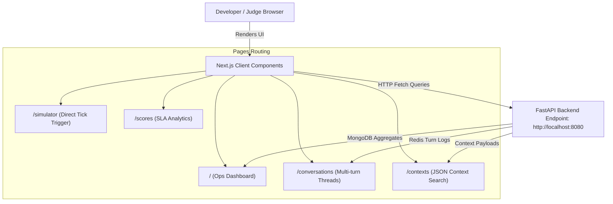
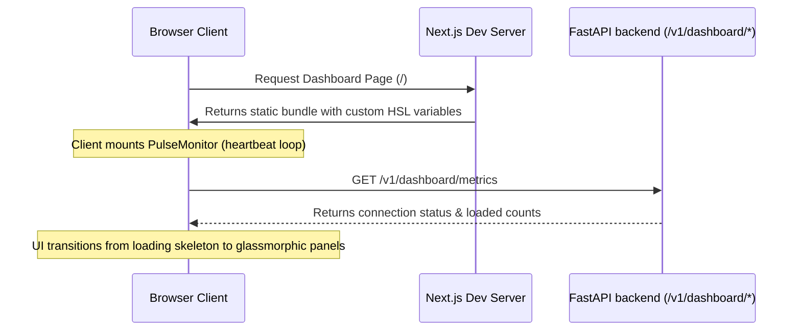

# 🌌 NEXORA Operations Dashboard (frontend)

Next.js (App Router) + TypeScript + Tailwind CSS dashboard designed for monitoring, testing, and auditing the NEXORA bot in real time. 

See the [repo-level README](../README.md) for full project context, architecture, and the FastAPI backend specifications it interacts with.

> [!IMPORTANT]
> ### 🌐 NEXORA Deployed Production Links
> 
> * **🖥️ Live Operations Dashboard (UI):** [https://nexorabot-ai.vercel.app/](https://nexorabot-ai.vercel.app/)
> * **⚡ Deployed Backend Engine (API):** [https://nexora-studio-0aaz.onrender.com/](https://nexora-studio-0aaz.onrender.com/) *(Health Endpoint: `/v1/healthz`)*
> 
> | Environment | Backend Endpoint | Frontend Dashboard |
> | :--- | :--- | :--- |
> | **☁️ Live Production** | `https://nexora-studio-0aaz.onrender.com/` | `https://nexorabot-ai.vercel.app/` |
> | **💻 Local Development** | `http://localhost:8080` | `http://localhost:3000` |


## 🗺️ Frontend-Backend Interaction Pipeline

The Next.js operational dashboard acts as a real-time monitor and debugger, communicating directly with FastAPI's analytics endpoints:



## 🚀 Setup & Installation

To run the Next.js app locally in development mode:

1.  **Install dependencies:**
    ```bash
    npm install
    ```

2.  **Configure environment variables:**
    Copy the example template and verify your backend endpoint:
    ```bash
    cp .env.example .env.local
    ```
    *Ensure `NEXT_PUBLIC_BOT_URL` points to your running FastAPI server (defaults to `http://localhost:8080`).*

3.  **Boot the development server:**
    ```bash
    npm run dev
    ```

Open [http://localhost:3000](http://localhost:3000) in your browser. The backend must be active to stream live stats. The UI degrades gracefully with a connection-error state if the backend is unreachable.

## 📦 Docker & Production Build

To run a production-ready standalone build:

```bash
npm run build
npm run start
```

### Standalone Optimization
The Next.js configuration is optimized using `output: "standalone"` (see `next.config.ts`) to output a minimal build bundle containing only production dependencies, which is compiled in the multi-stage `Dockerfile`.

> [!WARNING]
> `NEXT_PUBLIC_BOT_URL` is baked into the client bundle at **build** time. If your backend address changes, you must rebuild the application.

## 📊 Operations Dashboard Lifecycle



## 🧭 Pages & Feature Overview

### 1. Live Ops Overview (`/`)
*   **Heartbeat Monitor:** Integrates an ECG-style animated `PulseMonitor` showing backend responsiveness.
*   **System Health:** Heartbeat status indicators for MongoDB, Redis, and Groq API latency.
*   **Metrics Grid:** Displays current counts of loaded contexts (`category`, `merchant`, `customer`, `trigger`) and CTA distributions.

### 2. Conversation Timelines (`/conversations`)
*   **Multi-Turn Visualization:** Renders multi-turn conversation logs stored in Redis.
*   **Strike Badges:** Flags auto-reply strikes and locks visually.
*   **Action Markers:** Annotates intent transitions when the conversation switches to *Action Mode*.

### 3. Context Inspector (`/contexts`)
*   **Search and Filter:** Full-text searchable directory of categories, merchants, customers, and active triggers.
*   **JSON Tree View:** Displays the raw Pydantic schemas and metadata payloads for audits.

### 4. Interactive Simulator (`/simulator`)
*   **Endpoint Triggering:** Allows developers and judges to run health checks and manually fire tick events directly from the web browser.
*   **Terminal Log Stream:** Displays a running log console output from backend operations.

### 5. Compliance Scores (`/scores`)
*   **Audit Metrics:** Evaluates taboo word hits, Meta URL policy violations, and required field compliance computed client-side.
*   **Uptime & Processing Analytics:** Displays latency distribution maps for the Groq engine.

## 🎨 Design System & Aesthetics

NEXORA’s frontend uses a premium, dark-mode glassmorphic visual style:
*   **Colors:** Deep navy backdrops combined with glowing electric-blue highlights (`app/globals.css`, CSS properties prefixed with `--nexora-*`).
*   **Typography:** Renders standard UI elements in **Inter** and raw JSON/context schemas in **JetBrains Mono**.
*   **Glassmorphism:** Employs backdrop filters, subtle border gradients, and card highlights to create depth.
